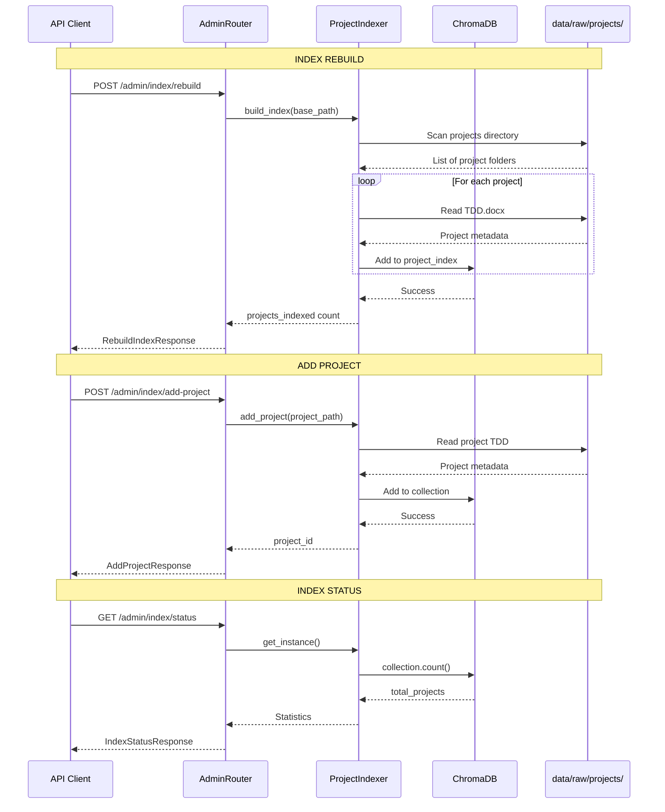

# Admin Component

The **admin** component provides administrative endpoints for managing the ChromaDB project index. It orchestrates the **ProjectIndexer** service to rebuild indexes, add individual projects, and monitor index health.

## Architecture Overview

```
┌─────────────────────────────────────────────────────────────────┐
│                      ADMIN COMPONENT                             │
├─────────────────────────────────────────────────────────────────┤
│                                                                  │
│  ┌──────────────┐      ┌────────────────────┐                   │
│  │   Router     │─────▶│  ProjectIndexer    │                   │
│  │  (FastAPI)   │      │   (Singleton)      │                   │
│  └──────────────┘      └─────────┬──────────┘                   │
│                                  │                               │
│                                  ▼                               │
│               ┌──────────────────────────────────┐              │
│               │      VectorStoreManager           │              │
│               │      (ChromaDB)                   │              │
│               └────────────────┬─────────────────┘              │
│                                │                                 │
│                                ▼                                 │
│                     ┌──────────────────────┐                    │
│                     │   project_index      │                    │
│                     │   collection         │                    │
│                     │   • Project metadata │                    │
│                     │   • TDD summaries    │                    │
│                     └──────────────────────┘                    │
│                                                                  │
└─────────────────────────────────────────────────────────────────┘
```

## File Structure

```
admin/
├── __init__.py      # Public exports
├── models.py        # Pydantic request/response schemas
├── router.py        # FastAPI administrative endpoints
└── README.md        # This file
```

**Note:** This component does NOT have a `service.py` file. It directly orchestrates the **ProjectIndexer** service (`app/services/project_indexer.py`) which handles all index management logic.

## Data Flow



## Models

### RebuildIndexResponse

Response for index rebuild operations.

```python
class RebuildIndexResponse(BaseModel):
    """Response for index rebuild request"""

    status: str              # "started", "completed", or "failed"
    message: str             # Human-readable status message
    projects_indexed: int    # Number of projects successfully indexed
```

### AddProjectRequest

Request to add a single project to the index.

```python
class AddProjectRequest(BaseModel):
    """Request to add single project to index"""

    project_folder: str      # Path to project folder
                            # Example: "data/raw/projects/PRJ-10056-new-project"
```

### AddProjectResponse

Response after adding a project.

```python
class AddProjectResponse(BaseModel):
    """Response for add project request"""

    status: str        # "success" or "failed"
    project_id: str    # Extracted project ID (e.g., "PRJ-10056")
    message: str       # Status message
```

### IndexStatusResponse

Response with current index statistics.

```python
class IndexStatusResponse(BaseModel):
    """Response with index statistics"""

    collection_name: str       # "project_index"
    total_projects: int        # Number of projects currently indexed
    chroma_persist_dir: str    # ChromaDB persistence directory path
    last_checked: datetime     # Timestamp of status check
```

## API Reference

### POST /api/v1/admin/index/rebuild

Rebuild the entire project index from scratch.

**Description:**
- Deletes existing `project_index` collection
- Scans `data/raw/projects/` directory
- Extracts metadata from each project's TDD file
- Indexes all projects in ChromaDB
- **Warning:** This is a destructive operation that removes the existing index

**Request:**
```bash
curl -X POST http://localhost:8000/api/v1/admin/index/rebuild
```

**Response:**
```json
{
    "status": "completed",
    "message": "Successfully indexed 5 projects",
    "projects_indexed": 5
}
```

**Status Codes:**
- `200 OK` - Index rebuilt successfully
- `404 NOT FOUND` - Projects directory not found
- `500 INTERNAL SERVER ERROR` - Rebuild failed

**Use Cases:**
- Initial index creation
- Full re-index after data corruption
- After manual changes to project files
- After significant schema changes

---

### POST /api/v1/admin/index/add-project

Add a single project to the index incrementally.

**Description:**
- Verifies project folder exists
- Extracts metadata from TDD.docx
- Adds to `project_index` collection
- **Non-destructive:** Existing index remains intact

**Request:**
```bash
curl -X POST http://localhost:8000/api/v1/admin/index/add-project \
  -H "Content-Type: application/json" \
  -d '{
    "project_folder": "data/raw/projects/PRJ-10056-new-project"
  }'
```

**Response:**
```json
{
    "status": "success",
    "project_id": "PRJ-10056",
    "message": "Project PRJ-10056 added to index"
}
```

**Status Codes:**
- `200 OK` - Project added successfully
- `404 NOT FOUND` - Project folder or TDD file not found
- `500 INTERNAL SERVER ERROR` - Indexing failed

**Use Cases:**
- Adding newly created projects without full rebuild
- Re-indexing specific projects after updates
- Incremental index maintenance

---

### GET /api/v1/admin/index/status

Get statistics about the project index.

**Description:**
- Returns current index size
- Shows ChromaDB configuration
- Provides timestamp of check

**Request:**
```bash
curl http://localhost:8000/api/v1/admin/index/status
```

**Response:**
```json
{
    "collection_name": "project_index",
    "total_projects": 5,
    "chroma_persist_dir": "./data/chroma",
    "last_checked": "2026-01-24T10:30:00.123456"
}
```

**Status Codes:**
- `200 OK` - Status retrieved successfully
- `500 INTERNAL SERVER ERROR` - Failed to access ChromaDB

**Use Cases:**
- Health monitoring
- Verify index size after operations
- Debug index-related issues

## ProjectIndexer Service

The admin component relies on **ProjectIndexer** (`app/services/project_indexer.py`), which provides:

### Key Methods

```python
class ProjectIndexer:
    @classmethod
    def get_instance(cls) -> "ProjectIndexer":
        """Thread-safe singleton instance"""

    async def build_index(self, base_path: Path) -> int:
        """
        Rebuild entire project index.

        Args:
            base_path: Path to projects directory (data/raw/projects/)

        Returns:
            Number of projects indexed
        """

    async def add_project(self, project_path: Path) -> str:
        """
        Add single project to index.

        Args:
            project_path: Path to specific project folder

        Returns:
            project_id: Extracted project ID

        Raises:
            FileNotFoundError: TDD file not found
        """
```

### Project Metadata Extraction

ProjectIndexer extracts the following metadata from each project's TDD.docx:

- **project_id**: Extracted from folder name (e.g., `PRJ-10056`)
- **project_name**: Human-readable name from folder
- **summary**: Epic description from TDD document
- **folder_path**: Absolute path to project folder
- **tdd_path**: Path to TDD.docx file
- **estimation_path**: Path to estimation.xlsx (optional)
- **jira_stories_path**: Path to jira_stories.xlsx (optional)

This metadata is stored in the `project_index` collection with embeddings for semantic search.

## Index Directory Structure

The admin component expects projects to follow this structure:

```
data/raw/projects/
├── PRJ-10051-inventory-sync-automation/
│   ├── TDD.docx                      # Required: Technical Design Document
│   ├── estimation.xlsx               # Optional: Effort estimation
│   ├── jira_stories.xlsx             # Optional: User stories
│   └── ...
├── PRJ-10052-payment-gateway-integration/
│   ├── TDD.docx
│   ├── estimation.xlsx
│   └── jira_stories.xlsx
└── PRJ-10053-user-authentication-module/
    └── TDD.docx
```

**Requirements:**
- Each project folder must contain a `TDD.docx` file
- Folder name should start with project ID (e.g., `PRJ-10051`)
- Estimation and Jira files are optional but recommended

## Configuration

Admin operations use settings from `app/components/base/config.py`:

```python
from app.components.base.config import get_settings

settings = get_settings()
# settings.chroma_persist_dir - ChromaDB storage location
# settings.chroma_collection_prefix - Collection name prefix
```

**Environment Variables:**
```bash
# .env file
CHROMA_PERSIST_DIR=./data/chroma
CHROMA_COLLECTION_PREFIX=elevance_
```

## Integration with Other Components

The admin component supports the following workflows:

```
┌─────────────────────────────────────────────────────────────────┐
│                    ADMIN INTEGRATION                             │
├─────────────────────────────────────────────────────────────────┤
│                                                                  │
│  1. Initial Setup                                               │
│     • Run rebuild_index to populate ChromaDB                    │
│     • historical_match agent can now search projects            │
│                                                                  │
│  2. Add New Project                                             │
│     • User creates new project in data/raw/projects/            │
│     • Admin adds via add-project endpoint                       │
│     • Project immediately available for search                  │
│                                                                  │
│  3. Monitor Health                                              │
│     • Use index/status to verify index size                     │
│     • Troubleshoot search issues                                │
│                                                                  │
└─────────────────────────────────────────────────────────────────┘
```

## Error Handling

The admin router implements comprehensive error handling:

```python
# Common error scenarios

# 1. Projects directory not found
raise HTTPException(
    status_code=status.HTTP_404_NOT_FOUND,
    detail="Projects directory not found: data/raw/projects"
)

# 2. Project folder not found
raise HTTPException(
    status_code=status.HTTP_404_NOT_FOUND,
    detail="Project folder not found: {project_folder}"
)

# 3. Index rebuild failure
raise HTTPException(
    status_code=status.HTTP_500_INTERNAL_SERVER_ERROR,
    detail=f"Index rebuild failed: {error_message}"
)

# 4. ChromaDB access failure
raise HTTPException(
    status_code=status.HTTP_500_INTERNAL_SERVER_ERROR,
    detail=f"Failed to get index status: {error_message}"
)
```

## Logging

Admin operations are logged with context:

```python
import logging
logger = logging.getLogger(__name__)

# Examples:
logger.info("Starting project index rebuild")
logger.info(f"Index rebuild completed: {projects_indexed} projects indexed")
logger.info(f"Adding project to index: {project_path}")
logger.error(f"Index rebuild failed: {e}", exc_info=True)
```

## Troubleshooting

### Issue: Rebuild fails with "Projects directory not found"

**Cause:** The `data/raw/projects/` directory doesn't exist.

**Solution:**
```bash
# Create projects directory
mkdir -p data/raw/projects

# Add sample project
mkdir -p data/raw/projects/PRJ-00001-sample-project
# Add TDD.docx to the folder
```

---

### Issue: Add project fails with "TDD file not found"

**Cause:** Project folder doesn't contain a `TDD.docx` file.

**Solution:**
```bash
# Verify TDD file exists
ls data/raw/projects/PRJ-10056-new-project/TDD.docx

# Add TDD file if missing
cp template/TDD.docx data/raw/projects/PRJ-10056-new-project/
```

---

### Issue: Index status shows 0 projects after rebuild

**Cause:**
- No valid projects found in directory
- TDD files are corrupted or unreadable
- ChromaDB connection issue

**Solution:**
```bash
# Check projects directory
ls data/raw/projects/

# Verify ChromaDB is accessible
curl http://localhost:8000/api/v1/health

# Check logs for specific errors
tail -f logs/app.log | grep "ProjectIndexer"

# Try adding a single project manually
curl -X POST http://localhost:8000/api/v1/admin/index/add-project \
  -H "Content-Type: application/json" \
  -d '{"project_folder": "data/raw/projects/PRJ-10051-test"}'
```

---

### Issue: Rebuild is too slow

**Cause:** Processing many large TDD documents.

**Solution:**
- Consider using `add-project` for incremental updates instead of full rebuilds
- Rebuild runs synchronously - future enhancement could make it async
- Check system resources (CPU, memory) during rebuild

---

### Issue: Projects not appearing in search after indexing

**Cause:**
- Index status shows projects, but search doesn't find them
- Embedding generation failed
- Collection name mismatch

**Solution:**
```bash
# Verify index status
curl http://localhost:8000/api/v1/admin/index/status

# Check ChromaDB collections
python scripts/inspect_chroma.py

# Rebuild with fresh ChromaDB
rm -rf data/chroma/
curl -X POST http://localhost:8000/api/v1/admin/index/rebuild
```

## Best Practices

1. **Initial Setup**: Always run `rebuild_index` when first setting up the system
2. **Incremental Updates**: Use `add-project` for new projects to avoid full rebuilds
3. **Monitoring**: Regularly check `index/status` to verify index health
4. **Backup**: Back up ChromaDB (`data/chroma/`) before rebuild operations
5. **Validation**: After rebuild, verify search functionality works
6. **Logging**: Monitor logs during index operations for errors

## Related Components

- **ProjectIndexer** (`app/services/project_indexer.py`) - Core indexing service
- **VectorStoreManager** (`app/rag/vector_store.py`) - ChromaDB wrapper
- **project_search** (`app/components/project_search/`) - Search endpoints using this index
- **historical_match** (`app/components/historical_match/`) - Agent that searches indexed projects

## Scripts

Related maintenance scripts:

```bash
# Rebuild project index (deletes and rebuilds)
python scripts/rebuild_project_index.py

# Full reindex (all collections)
python scripts/reindex.py && python scripts/init_vector_db.py
```

## Future Enhancements

Potential improvements for the admin component:

1. **Async Rebuild**: Run rebuild in background with progress tracking
2. **Batch Add**: Add multiple projects in single request
3. **Delete Project**: Remove specific projects from index
4. **Update Project**: Re-index single project after changes
5. **Index Validation**: Verify index integrity and consistency
6. **Export/Import**: Backup and restore index data
7. **Search Analytics**: Track which projects are most frequently matched
