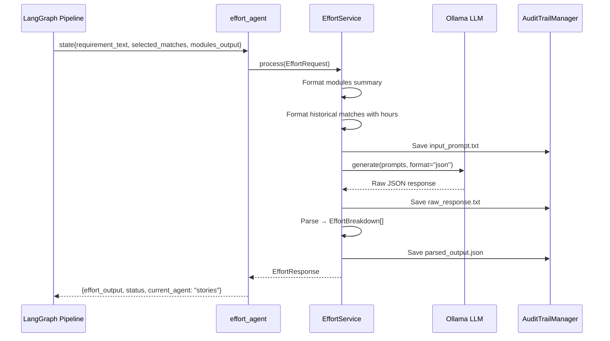

# Effort Component

The **effort** component is an LLM-powered agent that estimates development and QA hours based on the requirement, identified modules, and historical project data. It produces story point estimates and detailed hour breakdowns by category.

## Architecture Overview

```
┌─────────────────────────────────────────────────────────────────┐
│                      EFFORT COMPONENT                            │
├─────────────────────────────────────────────────────────────────┤
│                                                                  │
│  ┌──────────────┐      ┌───────────────────┐                    │
│  │   Router     │─────▶│   EffortService   │                    │
│  │  (FastAPI)   │      │  (BaseComponent)  │                    │
│  └──────────────┘      └─────────┬─────────┘                    │
│                                  │                               │
│  ┌──────────────┐                │                               │
│  │   Agent      │◀───────────────┤                               │
│  │ (LangGraph)  │                │                               │
│  └──────────────┘                │                               │
│                                  ▼                               │
│                        ┌─────────────────────┐                   │
│                        │   Context Building  │                   │
│                        │  • Requirement      │                   │
│                        │  • Modules summary  │                   │
│                        │  • Historical hours │                   │
│                        └─────────┬───────────┘                   │
│                                  │                               │
│                                  ▼                               │
│                        ┌─────────────────────┐                   │
│                        │   Ollama Client     │                   │
│                        │  (LLM Generation)   │                   │
│                        └─────────┬───────────┘                   │
│                                  │                               │
│                                  ▼                               │
│                        ┌─────────────────────┐                   │
│                        │   Effort Response   │                   │
│                        │  • Total hours      │                   │
│                        │  • Story points     │                   │
│                        │  • Breakdown        │                   │
│                        └─────────────────────┘                   │
│                                                                  │
└─────────────────────────────────────────────────────────────────┘
```

## File Structure

```
effort/
├── __init__.py      # Public exports
├── models.py        # Pydantic request/response schemas
├── service.py       # LLM invocation and response parsing
├── prompts.py       # System and user prompt templates
├── agent.py         # LangGraph node wrapper
├── router.py        # FastAPI endpoints
└── README.md        # This file
```

## Data Flow



## Code Walkthrough

### 1. Models (`models.py`)

Defines the data contracts for effort estimation.

```python
from pydantic import BaseModel, Field
from typing import List, Dict
from datetime import datetime

class EffortBreakdown(BaseModel):
    """Effort breakdown by category."""
    category: str
    dev_hours: int
    qa_hours: int
    description: str

class EffortRequest(BaseModel):
    """Request for effort estimation."""
    session_id: str
    requirement_text: str
    selected_matches: List[Dict]
    modules_output: Dict  # Output from modules agent

class EffortResponse(BaseModel):
    """Response with effort estimation."""
    session_id: str
    agent: str = "effort"
    total_dev_hours: int
    total_qa_hours: int
    total_hours: int
    story_points: int
    confidence: str = Field(..., pattern="^(HIGH|MEDIUM|LOW)$")
    breakdown: List[EffortBreakdown]
    generated_at: datetime
```

**Effort Breakdown Categories (typical):**

| Category | Description |
|----------|-------------|
| Frontend Development | UI components, pages, styling |
| Backend Development | API endpoints, business logic |
| Database Work | Schema changes, migrations, queries |
| Integration | Third-party APIs, external systems |
| Testing & QA | Unit tests, integration tests, manual QA |

---

### 2. Prompts (`prompts.py`)

LLM prompt templates for effort estimation.

```python
EFFORT_SYSTEM_PROMPT = """You are an expert software project estimator.

Given a requirement, impacted modules, and historical similar projects, estimate the development effort.

OUTPUT FORMAT (JSON only, no markdown):
{
  "total_dev_hours": integer,
  "total_qa_hours": integer,
  "story_points": integer,
  "confidence": "HIGH|MEDIUM|LOW",
  "breakdown": [
    {"category": "string", "dev_hours": integer, "qa_hours": integer, "description": "string"}
  ]
}

Provide a realistic estimate with 3-5 breakdown categories."""

EFFORT_USER_PROMPT = """REQUIREMENT:
{requirement_description}

IMPACTED MODULES:
{modules_summary}

SIMILAR HISTORICAL PROJECTS:
{formatted_historical_matches}

Estimate the development and QA effort for this requirement."""
```

**Estimation Guidance:**

- **Confidence** is based on historical data quality:
  - `HIGH`: Multiple similar projects with actual hours
  - `MEDIUM`: Some historical data, some assumptions
  - `LOW`: Limited data, estimate based on complexity

---

### 3. Service (`service.py`)

Core business logic for effort estimation.

```python
class EffortService(BaseComponent[EffortRequest, EffortResponse]):
    """Effort estimation agent as a component."""

    def __init__(self):
        self.ollama = get_ollama_client()

    @property
    def component_name(self) -> str:
        return "effort"
```

**Process Method:**

```python
async def process(self, request: EffortRequest) -> EffortResponse:
    """Estimate effort using LLM."""
    # Format context from previous agents
    modules_summary = self._format_modules(request.modules_output)
    formatted_matches = self._format_matches(request.selected_matches)

    user_prompt = EFFORT_USER_PROMPT.format(
        requirement_description=request.requirement_text,
        modules_summary=modules_summary,
        formatted_historical_matches=formatted_matches,
    )

    # Save input for audit
    audit = AuditTrailManager(request.session_id)
    audit.save_text(
        "input_prompt.txt",
        f"{EFFORT_SYSTEM_PROMPT}\n\n{user_prompt}",
        subfolder="step3_agents/agent_effort"
    )

    # Call LLM
    raw_response = await self.ollama.generate(
        system_prompt=EFFORT_SYSTEM_PROMPT,
        user_prompt=user_prompt,
        format="json",
    )

    audit.save_text("raw_response.txt", raw_response, subfolder="step3_agents/agent_effort")

    # Parse response
    parsed = self._parse_response(raw_response)
    breakdown = [EffortBreakdown(**b) for b in parsed.get("breakdown", [])]

    response = EffortResponse(
        session_id=request.session_id,
        total_dev_hours=parsed.get("total_dev_hours", 0),
        total_qa_hours=parsed.get("total_qa_hours", 0),
        total_hours=parsed.get("total_dev_hours", 0) + parsed.get("total_qa_hours", 0),
        story_points=parsed.get("story_points", 0),
        confidence=parsed.get("confidence", "MEDIUM"),
        breakdown=breakdown,
        generated_at=datetime.now(),
    )

    audit.save_json("parsed_output.json", response.model_dump(), subfolder="step3_agents/agent_effort")
    audit.add_step_completed("effort_estimated")

    return response
```

**Context Formatting Methods:**

```python
def _format_modules(self, modules_output: Dict) -> str:
    """Format modules for prompt."""
    lines = []
    # Include functional modules
    for m in modules_output.get("functional_modules", [])[:5]:
        lines.append(f"- {m.get('name')} ({m.get('impact')})")
    # Include technical modules
    for m in modules_output.get("technical_modules", [])[:5]:
        lines.append(f"- {m.get('name')} ({m.get('impact')})")
    return "\n".join(lines) if lines else "No modules identified."

def _format_matches(self, matches: List[Dict]) -> str:
    """Format matches for prompt - focus on hours data."""
    lines = []
    for m in matches[:3]:  # Top 3 matches
        hours = m.get("actual_hours") or m.get("estimated_hours") or "N/A"
        lines.append(f"- {m.get('epic_name', 'Unknown')}: {hours} hours")
    return "\n".join(lines) if lines else "No historical data."
```

---

### 4. Agent (`agent.py`)

LangGraph node wrapper.

```python
async def effort_agent(state: Dict[str, Any]) -> Dict[str, Any]:
    """LangGraph node for effort estimation."""
    try:
        service = get_service()

        request = EffortRequest(
            session_id=state["session_id"],
            requirement_text=state["requirement_text"],
            selected_matches=state.get("selected_matches", []),
            modules_output=state.get("modules_output", {}),  # From modules agent
        )

        response = await service.process(request)

        return {
            "effort_output": response.model_dump(),
            "status": "effort_estimated",
            "current_agent": "stories",  # Next agent
            "messages": [
                {
                    "role": "effort",
                    "content": f"Estimated {response.total_hours} total hours ({response.confidence} confidence)",
                }
            ],
        }

    except Exception as e:
        return {
            "status": "error",
            "error_message": str(e),
            "current_agent": "error_handler",
        }
```

---

## API Reference

### Endpoints

| Method | Path | Description | Response |
|--------|------|-------------|----------|
| `POST` | `/impact/generate/effort` | Estimate development effort | `EffortResponse` |

### Request/Response Examples

**Generate Effort Estimate:**

```bash
curl -X POST http://localhost:8000/impact/generate/effort \
  -H "Content-Type: application/json" \
  -d '{
    "session_id": "sess_20240115_103045_a1b2c3",
    "requirement_text": "Build OAuth2 authentication with SSO support...",
    "selected_matches": [
      {"epic_name": "SSO Implementation", "actual_hours": 240}
    ],
    "modules_output": {
      "functional_modules": [
        {"name": "User Authentication", "impact": "HIGH"}
      ],
      "technical_modules": [
        {"name": "API Gateway", "impact": "HIGH"}
      ]
    }
  }'
```

Response:
```json
{
  "session_id": "sess_20240115_103045_a1b2c3",
  "agent": "effort",
  "total_dev_hours": 160,
  "total_qa_hours": 40,
  "total_hours": 200,
  "story_points": 34,
  "confidence": "MEDIUM",
  "breakdown": [
    {
      "category": "Backend Development",
      "dev_hours": 80,
      "qa_hours": 20,
      "description": "OAuth2 flow implementation, token management"
    },
    {
      "category": "Frontend Development",
      "dev_hours": 40,
      "qa_hours": 10,
      "description": "Login UI, SSO redirect handling"
    },
    {
      "category": "Integration",
      "dev_hours": 24,
      "qa_hours": 6,
      "description": "IDP integration, SAML configuration"
    },
    {
      "category": "Database",
      "dev_hours": 16,
      "qa_hours": 4,
      "description": "Token storage schema, migrations"
    }
  ],
  "generated_at": "2024-01-15T10:30:45.123456"
}
```

---

## LLM Output Format

The LLM is instructed to return:

```json
{
  "total_dev_hours": 160,
  "total_qa_hours": 40,
  "story_points": 34,
  "confidence": "MEDIUM",
  "breakdown": [
    {
      "category": "Category Name",
      "dev_hours": 80,
      "qa_hours": 20,
      "description": "What this category covers"
    }
  ]
}
```

---

## Story Points Estimation

The LLM uses this general guidance:

| Story Points | Typical Hours Range | Complexity |
|--------------|---------------------|------------|
| 1-2 | 4-16 hours | Trivial / Simple |
| 3-5 | 16-40 hours | Standard |
| 8 | 40-80 hours | Complex |
| 13 | 80-160 hours | Very Complex |
| 21+ | 160+ hours | Epic-level (should be split) |

---

## Audit Trail Output

```
data/sessions/2024-01-15/sess_20240115_103045_a1b2c3/
└── step3_agents/
    └── agent_effort/
        ├── input_prompt.txt     # Full prompt with modules + matches
        ├── raw_response.txt     # Raw LLM output
        └── parsed_output.json   # Validated EffortResponse
```

---

## Integration with Pipeline

```
┌─────────────────────────────────────────────────────────────┐
│                    WORKFLOW POSITION                         │
├─────────────────────────────────────────────────────────────┤
│                                                              │
│  ┌──────────┐      ┌──────────┐      ┌──────────┐           │
│  │ modules  │─────▶│  effort  │─────▶│ stories  │──▶...     │
│  │          │      │  (HERE)  │      │          │           │
│  └──────────┘      └──────────┘      └──────────┘           │
│                                                              │
│  Input: requirement_text, selected_matches, modules_output   │
│  Output: effort_output                                       │
│  Next: current_agent = "stories"                             │
│                                                              │
└─────────────────────────────────────────────────────────────┘
```

---

## Troubleshooting

| Issue | Cause | Solution |
|-------|-------|----------|
| Unrealistic estimates | Poor historical data | Review matched projects for relevance |
| Missing breakdown | LLM format issue | Check `raw_response.txt` |
| `confidence: LOW` | Few historical matches | Expected when data is limited |
| Hours don't sum | LLM calculation error | Service calculates total_hours separately |

---

## Best Practices

1. **Review historical matches** - Ensure matched projects are truly similar
2. **Check confidence level** - LOW confidence = add buffer to estimates
3. **Validate breakdown** - Hours should align with modules identified
4. **Compare with actuals** - Track estimate vs. actual for calibration
5. **Consider team velocity** - Adjust story points for team capacity
