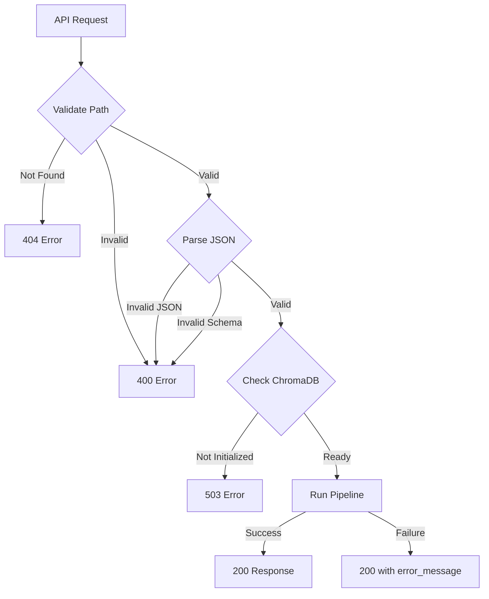

# File Input Component

The **file_input** component enables file-based pipeline execution. It reads JSON input files from a secure directory, validates them, and triggers the full impact assessment pipeline without requiring interactive API calls.

## Architecture Overview

```
┌─────────────────────────────────────────────────────────────────┐
│                    FILE INPUT COMPONENT                          │
├─────────────────────────────────────────────────────────────────┤
│                                                                  │
│  ┌──────────────┐      ┌───────────────────┐                    │
│  │   Router     │─────▶│ FileInputService  │                    │
│  │  (FastAPI)   │      │                   │                    │
│  └──────────────┘      └─────────┬─────────┘                    │
│                                  │                               │
│                                  │ 1. Validate path             │
│                                  │ 2. Parse JSON                 │
│                                  │ 3. Check ChromaDB             │
│                                  │ 4. Run pipeline               │
│                                  │                               │
│                                  ▼                               │
│  ┌────────────────────────────────────────────────────────┐     │
│  │                FILE SYSTEM                              │     │
│  │                                                         │     │
│  │   input/                   data/sessions/               │     │
│  │   └── new_req.txt  ────►   └── 2024-01-15/             │     │
│  │       (JSON input)             └── sess_my-001/         │     │
│  │                                    └── final_summary.json│    │
│  └────────────────────────────────────────────────────────┘     │
│                                  │                               │
│                                  │ delegates to                  │
│                                  ▼                               │
│                        ┌─────────────────────┐                   │
│                        │ OrchestratorService │                   │
│                        │  (Full Pipeline)    │                   │
│                        └─────────────────────┘                   │
│                                                                  │
└─────────────────────────────────────────────────────────────────┘
```

## File Structure

```
file_input/
├── __init__.py      # Public exports
├── models.py        # Pydantic request/response schemas
├── service.py       # File processing and pipeline triggering
├── router.py        # FastAPI endpoints
└── README.md        # This file
```

## Use Case

The file_input component is designed for:

1. **Batch processing** - Submit multiple requirements without manual API interaction
2. **CI/CD integration** - Trigger impact assessments from automated pipelines
3. **Testing** - Run repeatable assessments with fixture files
4. **Script-based workflows** - Process requirements programmatically

## Code Walkthrough

### 1. Models (`models.py`)

Defines the input file schema and response contracts.

```python
from pydantic import BaseModel, Field, field_validator
from typing import Dict, List

class FileInputRequest(BaseModel):
    """Request to process a file through the pipeline."""
    file_path: str = Field(
        ...,
        description="Path to input file (relative to backend root, e.g., 'input/new_req.txt')"
    )

class FileInputContent(BaseModel):
    """Schema for the JSON content inside the input file."""
    session_id: str = Field(
        ...,
        min_length=1,
        description="Unique session identifier for tracking this pipeline run"
    )
    requirement_text: str = Field(
        ...,
        min_length=10,
        description="The requirement or epic description to analyze"
    )
    jira_epic_id: str | None = Field(
        default=None,
        description="Optional Jira epic ID for traceability"
    )
    selected_matches: List[Dict] = Field(
        default_factory=list,
        description="Pre-selected matches (empty list = auto-select top 5)"
    )

    @field_validator("session_id")
    @classmethod
    def validate_session_id(cls, v: str) -> str:
        """Ensure session_id contains only safe characters."""
        import re
        if not re.match(r"^[a-zA-Z0-9_-]+$", v):
            raise ValueError(
                "session_id must contain only alphanumeric, underscore, or hyphen characters"
            )
        return v

class FileProcessingResponse(BaseModel):
    """Response from file processing endpoint."""
    session_id: str = Field(..., description="The session ID from the processed file")
    status: str = Field(..., description="Pipeline completion status")
    output_path: str = Field(..., description="Path to session output directory")
    message: str = Field(..., description="Human-readable status message")
    error_message: str | None = Field(default=None, description="Error details if failed")
```

**Input File Format (JSON):**

```json
{
  "session_id": "my-session-001",
  "requirement_text": "Build OAuth2 authentication with SSO support...",
  "jira_epic_id": "PROJ-1234",
  "selected_matches": []
}
```

---

### 2. Service (`service.py`)

Core business logic with security validations.

```python
from pathlib import Path
from app.components.orchestrator.service import OrchestratorService, PipelineRequest

class FileInputService:
    """Service for file-based pipeline execution."""

    # Security: Only allow files from this directory
    ALLOWED_INPUT_DIR = "input"

    # Required collections for pipeline
    REQUIRED_COLLECTIONS = ["epics", "estimations", "tdds", "stories", "gitlab_code"]

    def __init__(self):
        self.settings = get_settings()
        self._orchestrator: OrchestratorService | None = None

    @property
    def orchestrator(self) -> OrchestratorService:
        """Lazy-load orchestrator service."""
        if self._orchestrator is None:
            self._orchestrator = OrchestratorService()
        return self._orchestrator
```

**Path Validation (Security Critical):**

```python
def _validate_file_path(self, file_path: str) -> Path:
    """Validate file path is within allowed directory and exists."""
    backend_root = self._get_backend_root()

    # Resolve the full path
    full_path = (backend_root / file_path).resolve()

    # Security: Ensure path is within allowed input directory
    allowed_dir = (backend_root / self.ALLOWED_INPUT_DIR).resolve()
    if not str(full_path).startswith(str(allowed_dir)):
        raise ComponentError(
            f"File path must be within '{self.ALLOWED_INPUT_DIR}/' directory",
            component="file_input",
            details={"file_path": file_path, "allowed_dir": self.ALLOWED_INPUT_DIR}
        )

    # Check file exists
    if not full_path.exists():
        raise ComponentError(
            f"File not found: {file_path}",
            component="file_input",
            details={"file_path": file_path}
        )

    return full_path
```

This prevents **path traversal attacks** like `../../../etc/passwd`.

**Process File Method:**

```python
async def process_file(self, file_path: str) -> FileProcessingResponse:
    """Process an input file through the full pipeline."""

    # Step 1: Validate file path (security + existence)
    validated_path = self._validate_file_path(file_path)

    # Step 2: Parse and validate JSON content
    content = self._parse_file_content(validated_path)

    # Step 3: Verify ChromaDB is initialized
    self._check_vector_db_initialized()

    # Step 4: Build pipeline request
    request = PipelineRequest(
        session_id=content.session_id,
        requirement_text=content.requirement_text,
        jira_epic_id=content.jira_epic_id,
        selected_matches=content.selected_matches,
    )

    # Step 5: Run the pipeline
    try:
        response = await self.orchestrator.process(request)
    except Exception as e:
        return FileProcessingResponse(
            session_id=content.session_id,
            status="failed",
            output_path=self._get_output_path(content.session_id),
            message="Pipeline execution failed",
            error_message=str(e)
        )

    # Step 6: Return result
    return FileProcessingResponse(
        session_id=response.session_id,
        status=response.status,
        output_path=self._get_output_path(content.session_id),
        message=f"Pipeline completed with status: {response.status}",
        error_message=response.error_message
    )
```

**ChromaDB Validation:**

```python
def _check_vector_db_initialized(self) -> None:
    """Verify ChromaDB has required collections with data."""
    try:
        vector_store = ChromaVectorStore.get_instance()
        existing_collections = vector_store.list_collections()
    except Exception as e:
        raise ComponentError(
            f"Failed to connect to ChromaDB: {e}",
            component="file_input",
            details={"chroma_dir": self.settings.chroma_persist_dir}
        )

    # Check if required collections exist
    prefix = self.settings.chroma_collection_prefix
    missing = []
    for name in self.REQUIRED_COLLECTIONS:
        full_name = f"{prefix}_{name}"
        if full_name not in existing_collections:
            missing.append(name)

    if missing:
        raise ComponentError(
            "ChromaDB not initialized. Run 'python scripts/init_vector_db.py' first.",
            component="file_input",
            details={"missing_collections": missing}
        )
```

---

### 3. Router (`router.py`)

FastAPI endpoint with detailed documentation.

```python
router = APIRouter(prefix="/impact", tags=["File Input"])

@router.post("/process-file", response_model=FileProcessingResponse)
async def process_file(request: FileInputRequest) -> FileProcessingResponse:
    """Process an input file through the impact assessment pipeline.

    This endpoint reads a JSON-formatted input file from the `input/` directory
    and runs it through the full LangGraph multi-agent pipeline.

    **Input File Format (JSON):**
    ```json
    {
        "session_id": "my-session-001",
        "requirement_text": "Description of the requirement...",
        "jira_epic_id": "PROJ-123",  // optional
        "selected_matches": []       // empty = auto-select top 5
    }
    ```

    **Error Codes:**
    - 400: Invalid file path, JSON format, or schema
    - 404: File not found
    - 503: ChromaDB not initialized
    """
    service = get_service()

    try:
        result = await service.process_file(request.file_path)
        return result
    except ComponentError as e:
        if "not found" in str(e).lower():
            raise HTTPException(status_code=404, detail=e.to_dict())
        elif "chromadb not initialized" in str(e).lower():
            raise HTTPException(status_code=503, detail=e.to_dict())
        else:
            raise HTTPException(status_code=400, detail=e.to_dict())
```

---

## API Reference

### Endpoints

| Method | Path | Description | Response |
|--------|------|-------------|----------|
| `POST` | `/impact/process-file` | Process input file through pipeline | `FileProcessingResponse` |

### Request/Response Examples

**Process File:**

```bash
curl -X POST http://localhost:8000/api/v1/impact/process-file \
  -H "Content-Type: application/json" \
  -d '{"file_path": "input/new_req.txt"}'
```

Response (Success):
```json
{
  "session_id": "my-session-001",
  "status": "completed",
  "output_path": "data/sessions/2024-01-15/my-session-001/",
  "message": "Pipeline completed with status: completed",
  "error_message": null
}
```

Response (Error - File Not Found):
```json
{
  "error": "ComponentError",
  "message": "File not found: input/missing.txt",
  "component": "file_input",
  "details": {"file_path": "input/missing.txt"}
}
```

Response (Error - ChromaDB Not Initialized):
```json
{
  "error": "ComponentError",
  "message": "ChromaDB not initialized. Run 'python scripts/init_vector_db.py' first.",
  "component": "file_input",
  "details": {
    "missing_collections": ["epics", "estimations"],
    "hint": "python scripts/init_vector_db.py"
  }
}
```

---

## Input File Format

Create a JSON file in the `input/` directory:

**input/new_req.txt:**
```json
{
  "session_id": "oauth-feature-2024-01",
  "requirement_text": "Build OAuth2 authentication system with SSO support. The system should handle login, logout, token refresh, and session management. It should integrate with Okta as the identity provider and support both web and mobile clients.",
  "jira_epic_id": "PROJ-1234",
  "selected_matches": []
}
```

**Field Descriptions:**

| Field | Required | Description |
|-------|----------|-------------|
| `session_id` | Yes | Unique identifier for this run (alphanumeric, `_`, `-`) |
| `requirement_text` | Yes | The requirement to analyze (min 10 chars) |
| `jira_epic_id` | No | Optional Jira epic link |
| `selected_matches` | No | Pre-selected matches; empty = auto-select top 5 |

---

## Security Considerations

```
┌─────────────────────────────────────────────────────────────┐
│                    SECURITY MEASURES                         │
├─────────────────────────────────────────────────────────────┤
│                                                              │
│  1. PATH RESTRICTION                                         │
│     ✓ Files must be in input/ directory                     │
│     ✓ Path traversal blocked (../../../etc/passwd)          │
│     ✓ Symlinks resolved before validation                   │
│                                                              │
│  2. SESSION ID VALIDATION                                    │
│     ✓ Only alphanumeric, underscore, hyphen allowed         │
│     ✓ Prevents directory injection attacks                  │
│                                                              │
│  3. JSON SCHEMA VALIDATION                                   │
│     ✓ Pydantic enforces strict schema                       │
│     ✓ Invalid fields rejected                               │
│                                                              │
└─────────────────────────────────────────────────────────────┘
```

---

## Workflow



---

## Usage Examples

### Basic File Processing

```bash
# 1. Create input file
cat > input/my_req.txt << 'EOF'
{
  "session_id": "test-001",
  "requirement_text": "Add user authentication with OAuth2 support",
  "jira_epic_id": "AUTH-100"
}
EOF

# 2. Process the file
curl -X POST http://localhost:8000/api/v1/impact/process-file \
  -H "Content-Type: application/json" \
  -d '{"file_path": "input/my_req.txt"}'

# 3. Check output
ls data/sessions/$(date +%Y-%m-%d)/test-001/
```

### Batch Processing Script

```python
import httpx
import json
from pathlib import Path

async def process_requirements(input_dir: str = "input"):
    """Process all JSON files in input directory."""
    async with httpx.AsyncClient(base_url="http://localhost:8000") as client:
        for file in Path(input_dir).glob("*.txt"):
            response = await client.post(
                "/api/v1/impact/process-file",
                json={"file_path": f"input/{file.name}"}
            )
            result = response.json()
            print(f"{file.name}: {result['status']}")
```

---

## Troubleshooting

| Issue | Cause | Solution |
|-------|-------|----------|
| `File path must be within input/` | Path traversal attempt | Use paths like `input/file.txt` |
| `File not found` | File doesn't exist | Check file path and permissions |
| `ChromaDB not initialized` | Missing vector collections | Run `scripts/init_vector_db.py` |
| `Invalid JSON format` | Malformed JSON | Validate JSON syntax |
| `session_id validation error` | Invalid characters | Use only `a-z`, `0-9`, `_`, `-` |

---

## Best Practices

1. **Use descriptive session IDs** - Include date/project for traceability
2. **Validate JSON before submission** - Use `jq` or JSON validators
3. **Monitor output directory** - Check for error files
4. **Keep input files immutable** - Don't modify after processing
5. **Clean up old input files** - Implement retention policy
