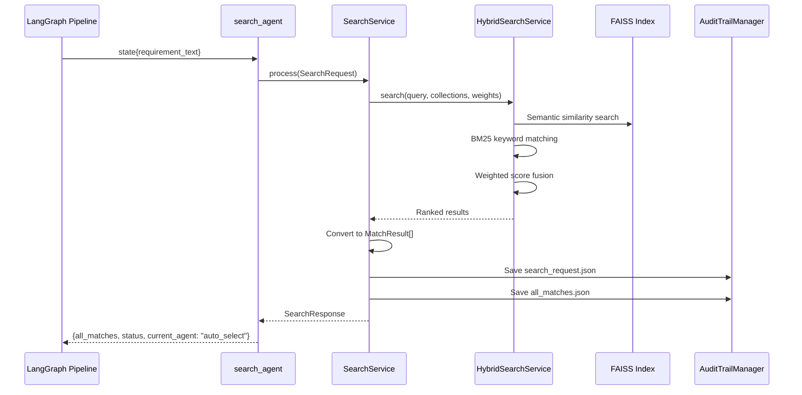

# Search Component

The **search** component performs hybrid search (semantic + keyword) to find historically similar projects from the knowledge base. It leverages FAISS vector embeddings combined with BM25 keyword matching to return the most relevant matches.

## Architecture Overview

```
┌─────────────────────────────────────────────────────────────────┐
│                     SEARCH COMPONENT                             │
├─────────────────────────────────────────────────────────────────┤
│                                                                  │
│  ┌──────────────┐      ┌───────────────────┐                    │
│  │   Router     │─────▶│   SearchService   │                    │
│  │  (FastAPI)   │      │  (BaseComponent)  │                    │
│  └──────────────┘      └─────────┬─────────┘                    │
│                                  │                               │
│  ┌──────────────┐                │                               │
│  │   Agent      │◀───────────────┤                               │
│  │ (LangGraph)  │                │                               │
│  └──────────────┘                ▼                               │
│                        ┌─────────────────────┐                   │
│                        │  HybridSearchService│                   │
│                        │  (from app.rag)     │                   │
│                        └─────────┬───────────┘                   │
│                                  │                               │
│              ┌───────────────────┼───────────────────┐           │
│              ▼                   ▼                   ▼           │
│    ┌────────────────┐  ┌────────────────┐  ┌────────────────┐   │
│    │ FAISS Semantic │  │ BM25 Keyword   │  │  Score Fusion  │   │
│    │    Search      │  │    Search      │  │  (Weighted)    │   │
│    └────────────────┘  └────────────────┘  └────────────────┘   │
│                                                                  │
│  ┌──────────────┐                                               │
│  │    Tools     │  LangChain tool wrapper for agent use         │
│  │  (Optional)  │                                               │
│  └──────────────┘                                               │
│                                                                  │
└─────────────────────────────────────────────────────────────────┘
```

## File Structure

```
search/
├── __init__.py      # Public exports
├── models.py        # Pydantic request/response schemas
├── service.py       # Hybrid search orchestration
├── agent.py         # LangGraph node wrapper
├── tools.py         # LangChain tool wrapper (for ReAct agents)
├── router.py        # FastAPI endpoints
└── README.md        # This file
```

## Data Flow



## Code Walkthrough

### 1. Models (`models.py`)

Defines the data contracts for search operations.

```python
from pydantic import BaseModel, Field
from typing import Optional, List, Dict

class SearchRequest(BaseModel):
    """Request to search for historical matches."""
    session_id: str
    query: str
    semantic_weight: float = Field(default=0.7, ge=0.0, le=1.0)
    keyword_weight: float = Field(default=0.3, ge=0.0, le=1.0)
    max_results: int = Field(default=10, ge=1, le=50)

class MatchResult(BaseModel):
    """Single match result."""
    match_id: str
    epic_id: str
    epic_name: str
    description: str
    match_score: float
    score_breakdown: Dict[str, float]
    technologies: List[str] = []
    actual_hours: Optional[int] = None
    estimated_hours: Optional[int] = None

class SearchResponse(BaseModel):
    """Search results response."""
    session_id: str
    total_matches: int
    matches: List[MatchResult]
    search_time_ms: int

class MatchSelectionRequest(BaseModel):
    """Request to select matches for impact analysis."""
    session_id: str
    selected_match_ids: List[str]
```

**Model Relationships:**

| Model | Purpose | Used By |
|-------|---------|---------|
| `SearchRequest` | Search parameters | `/search/find-matches` |
| `MatchResult` | Individual match | Nested in SearchResponse |
| `SearchResponse` | Full search results | All search endpoints |
| `MatchSelectionRequest` | User-selected matches | `/search/select-matches` |

---

### 2. Service (`service.py`)

The core business logic for hybrid search.

```python
import time
from app.components.base.component import BaseComponent
from app.rag.hybrid_search import HybridSearchService

class SearchService(BaseComponent[SearchRequest, SearchResponse]):
    """Hybrid search service as a component."""

    def __init__(self):
        self.hybrid_search = HybridSearchService.get_instance()
        self.config = get_settings()

    @property
    def component_name(self) -> str:
        return "search"
```

**Process Method:**

```python
async def process(self, request: SearchRequest) -> SearchResponse:
    """Execute hybrid search."""
    start = time.time()

    # Execute hybrid search across multiple collections
    results = await self.hybrid_search.search(
        query=request.query,
        collections=["epics", "estimations", "tdds"],
        top_k=request.max_results,
        semantic_weight=request.semantic_weight,
        keyword_weight=request.keyword_weight,
    )

    # Convert raw results to typed models
    matches = [self._convert_to_match_result(r) for r in results]
    elapsed_ms = int((time.time() - start) * 1000)

    # Save to audit trail
    audit = AuditTrailManager(request.session_id)
    audit.save_json(
        "search_request.json",
        request.model_dump(),
        subfolder="step2_search",
    )
    audit.save_json(
        "all_matches.json",
        [m.model_dump() for m in matches],
        subfolder="step2_search",
    )
    audit.record_timing("search", elapsed_ms)

    return SearchResponse(
        session_id=request.session_id,
        total_matches=len(matches),
        matches=matches,
        search_time_ms=elapsed_ms,
    )
```

**Result Conversion:**

```python
def _convert_to_match_result(self, result: Dict) -> MatchResult:
    """Convert raw search result to MatchResult."""
    metadata = result.get("metadata", {})
    technologies = self._parse_list_field(metadata.get("technologies", []))

    return MatchResult(
        match_id=result.get("id", ""),
        epic_id=metadata.get("epic_id", ""),
        epic_name=metadata.get("epic_name", result.get("text", "")[:100]),
        description=result.get("text", "")[:500],
        match_score=result.get("final_score", 0.0),
        score_breakdown=result.get("score_breakdown", {}),
        technologies=technologies,
        actual_hours=metadata.get("actual_hours"),
        estimated_hours=metadata.get("estimated_hours"),
    )
```

**List Field Parsing (handles ChromaDB quirks):**

```python
def _parse_list_field(self, value) -> List[str]:
    """Parse a list field that may be stored as a string."""
    if isinstance(value, list):
        return value
    if not isinstance(value, str):
        return []

    # Try JSON parsing (handles double-quoted strings)
    try:
        parsed = json.loads(value)
        return parsed if isinstance(parsed, list) else []
    except json.JSONDecodeError:
        pass

    # Handle Python-style single quotes
    try:
        normalized = value.replace("'", '"')
        parsed = json.loads(normalized)
        return parsed if isinstance(parsed, list) else []
    except json.JSONDecodeError:
        return []
```

This is necessary because ChromaDB sometimes stores lists as strings like `"['Python', 'FastAPI']"`.

---

### 3. Agent (`agent.py`)

LangGraph node for workflow integration.

```python
async def search_agent(state: Dict[str, Any]) -> Dict[str, Any]:
    """LangGraph node for historical search.

    Returns PARTIAL state update.
    """
    try:
        service = get_service()

        request = SearchRequest(
            session_id=state["session_id"],
            query=state["requirement_text"],
        )

        response = await service.process(request)
        matches = [m.model_dump() for m in response.matches]

        return {
            "all_matches": matches,
            "status": "matches_found",
            "current_agent": "await_selection",
            "messages": [
                {
                    "role": "search",
                    "content": f"Found {response.total_matches} similar projects",
                }
            ],
            "timing": {"search_ms": response.search_time_ms},
        }

    except Exception as e:
        return {
            "status": "error",
            "error_message": str(e),
            "current_agent": "error_handler",
        }
```

---

### 4. Tools (`tools.py`)

LangChain tool wrapper for use in ReAct-style agents.

```python
from langchain_core.tools import tool
import asyncio

@tool
def search_similar_projects(
    query: str,
    top_k: int = 10,
    semantic_weight: float = 0.7,
) -> List[Dict]:
    """Search for similar historical projects.

    Args:
        query: Search query (requirement text)
        top_k: Number of results to return
        semantic_weight: Weight for semantic vs keyword search

    Returns:
        List of matching projects with scores
    """
    from .service import SearchService
    from .models import SearchRequest

    service = SearchService()
    request = SearchRequest(
        session_id="tool_call",
        query=query,
        semantic_weight=semantic_weight,
        keyword_weight=1.0 - semantic_weight,
        max_results=top_k,
    )

    response = asyncio.get_event_loop().run_until_complete(
        service.process(request)
    )
    return [m.model_dump() for m in response.matches]
```

This tool enables integration with LangChain agents that can dynamically decide to search.

---

### 5. Router (`router.py`)

FastAPI endpoints for direct HTTP access.

```python
router = APIRouter(prefix="/search", tags=["Search"])

@router.post("/find-matches", response_model=SearchResponse)
async def find_matches(
    request: SearchRequest,
    service: SearchService = Depends(get_service),
) -> SearchResponse:
    """Search for similar historical projects."""
    try:
        return await service.process(request)
    except ComponentError as e:
        raise HTTPException(status_code=400, detail=e.to_dict())

@router.post("/select-matches", response_model=MatchSelectionResponse)
async def select_matches(
    request: MatchSelectionRequest,
    service: SearchService = Depends(get_service),
) -> MatchSelectionResponse:
    """Select matches for impact analysis."""
    try:
        return await service.select_matches(request)
    except ComponentError as e:
        raise HTTPException(status_code=400, detail=e.to_dict())
```

---

## API Reference

### Endpoints

| Method | Path | Description | Response |
|--------|------|-------------|----------|
| `POST` | `/search/find-matches` | Find similar projects | `SearchResponse` |
| `POST` | `/search/select-matches` | Select matches for analysis | `MatchSelectionResponse` |

### Request/Response Examples

**Find Matches:**

```bash
curl -X POST http://localhost:8000/search/find-matches \
  -H "Content-Type: application/json" \
  -d '{
    "session_id": "sess_20240115_103045_a1b2c3",
    "query": "Build user authentication with OAuth2",
    "semantic_weight": 0.7,
    "keyword_weight": 0.3,
    "max_results": 10
  }'
```

Response:
```json
{
  "session_id": "sess_20240115_103045_a1b2c3",
  "total_matches": 10,
  "matches": [
    {
      "match_id": "epic_001",
      "epic_id": "PROJ-100",
      "epic_name": "Implement SSO Authentication",
      "description": "Single sign-on implementation using SAML and OAuth2...",
      "match_score": 0.89,
      "score_breakdown": {
        "semantic": 0.92,
        "keyword": 0.82
      },
      "technologies": ["Python", "FastAPI", "OAuth2"],
      "actual_hours": 240,
      "estimated_hours": 200
    }
  ],
  "search_time_ms": 145
}
```

**Select Matches:**

```bash
curl -X POST http://localhost:8000/search/select-matches \
  -H "Content-Type: application/json" \
  -d '{
    "session_id": "sess_20240115_103045_a1b2c3",
    "selected_match_ids": ["epic_001", "epic_003", "epic_007"]
  }'
```

---

## Hybrid Search Algorithm

```
┌─────────────────────────────────────────────────────────────┐
│              HYBRID SEARCH SCORING                           │
├─────────────────────────────────────────────────────────────┤
│                                                              │
│  Query: "Build user authentication with OAuth2"              │
│                                                              │
│  ┌────────────────┐    ┌────────────────┐                   │
│  │ Semantic Score │    │ Keyword Score  │                   │
│  │   (FAISS)      │    │   (BM25)       │                   │
│  │                │    │                │                   │
│  │  embed(query)  │    │  tokenize(q)   │                   │
│  │       ↓        │    │       ↓        │                   │
│  │  cosine_sim()  │    │  tf-idf match  │                   │
│  │       ↓        │    │       ↓        │                   │
│  │   0.92         │    │   0.82         │                   │
│  └───────┬────────┘    └───────┬────────┘                   │
│          │                     │                             │
│          └──────┬──────────────┘                            │
│                 ▼                                            │
│  ┌────────────────────────────────────┐                     │
│  │      Weighted Score Fusion         │                     │
│  │                                    │                     │
│  │  final = (0.7 × 0.92) + (0.3 × 0.82) │                  │
│  │  final = 0.644 + 0.246 = 0.89      │                     │
│  └────────────────────────────────────┘                     │
│                                                              │
└─────────────────────────────────────────────────────────────┘
```

**Weight Tuning Guidelines:**

| Scenario | Semantic | Keyword | Rationale |
|----------|----------|---------|-----------|
| Default | 0.7 | 0.3 | Balanced, good for general use |
| Technical queries | 0.5 | 0.5 | Technical terms need exact match |
| Conceptual queries | 0.8 | 0.2 | Semantic similarity matters more |
| Known keywords | 0.3 | 0.7 | Exact term matching preferred |

---

## Audit Trail Output

```
data/sessions/2024-01-15/sess_20240115_103045_a1b2c3/
└── step2_search/
    ├── search_request.json    # Original request parameters
    ├── all_matches.json       # All returned matches
    └── selected_matches.json  # User-selected matches (after selection)
```

---

## Integration with Pipeline

```
┌─────────────────────────────────────────────────────────────┐
│                    WORKFLOW POSITION                         │
├─────────────────────────────────────────────────────────────┤
│                                                              │
│  ┌─────────────┐      ┌──────────┐      ┌─────────────┐     │
│  │ requirement │─────▶│  search  │─────▶│ auto_select │──▶..│
│  │             │      │  (HERE)  │      │             │     │
│  └─────────────┘      └──────────┘      └─────────────┘     │
│                                                              │
│  Input: requirement_text                                     │
│  Output: all_matches                                         │
│  Next: current_agent = "auto_select"                         │
│                                                              │
└─────────────────────────────────────────────────────────────┘
```

---

## Troubleshooting

| Issue | Cause | Solution |
|-------|-------|----------|
| No matches found | Empty vector index | Run `scripts/init_vector_db.py` |
| Low relevance scores | Poor embeddings | Check embedding model quality |
| Slow search | Large index | Optimize FAISS index type |
| Technologies empty | String parsing issue | Check `_parse_list_field()` |
| `SearchWeightsInvalidError` | Weights don't sum to 1 | Use complementary weights |

---

## Best Practices

1. **Tune weights per use case** - Technical requirements need higher keyword weight
2. **Limit max_results** - More results = slower response
3. **Review score breakdown** - Helps understand why matches were returned
4. **Pre-filter collections** - Search only relevant collections
5. **Monitor search timing** - Use audit trail to identify slow queries
