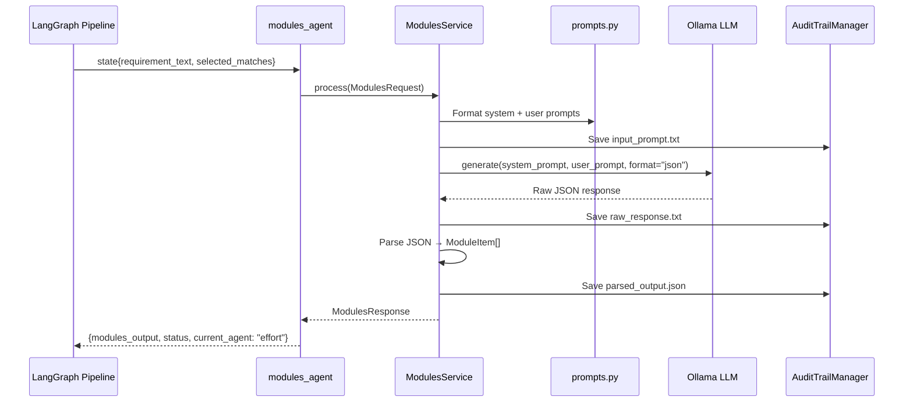

# Modules Component

The **modules** component is an LLM-powered agent that identifies impacted functional and technical modules based on the requirement and historical matches. It's the first AI analysis step in the impact assessment pipeline.

## Architecture Overview

```
┌─────────────────────────────────────────────────────────────────┐
│                     MODULES COMPONENT                            │
├─────────────────────────────────────────────────────────────────┤
│                                                                  │
│  ┌──────────────┐      ┌───────────────────┐                    │
│  │   Router     │─────▶│  ModulesService   │                    │
│  │  (FastAPI)   │      │  (BaseComponent)  │                    │
│  └──────────────┘      └─────────┬─────────┘                    │
│                                  │                               │
│  ┌──────────────┐                │                               │
│  │   Agent      │◀───────────────┤                               │
│  │ (LangGraph)  │                │                               │
│  └──────────────┘                │                               │
│                                  ▼                               │
│                        ┌─────────────────────┐                   │
│                        │   Prompt Building   │                   │
│                        │  • System prompt    │                   │
│                        │  • Formatted context│                   │
│                        └─────────┬───────────┘                   │
│                                  │                               │
│                                  ▼                               │
│                        ┌─────────────────────┐                   │
│                        │   Ollama Client     │                   │
│                        │  (LLM Generation)   │                   │
│                        └─────────┬───────────┘                   │
│                                  │                               │
│                                  ▼                               │
│                        ┌─────────────────────┐                   │
│                        │   JSON Parsing      │                   │
│                        │  → ModuleItem[]     │                   │
│                        └─────────────────────┘                   │
│                                                                  │
└─────────────────────────────────────────────────────────────────┘
```

## File Structure

```
modules/
├── __init__.py      # Public exports
├── models.py        # Pydantic request/response schemas
├── service.py       # LLM invocation and response parsing
├── prompts.py       # System and user prompt templates
├── agent.py         # LangGraph node wrapper
├── router.py        # FastAPI endpoints
└── README.md        # This file
```

## Data Flow



## Code Walkthrough

### 1. Models (`models.py`)

Defines the data contracts for module identification.

```python
from pydantic import BaseModel, Field
from typing import List, Dict
from datetime import datetime

class ModuleItem(BaseModel):
    """Single module in impact analysis."""
    name: str
    impact: str = Field(..., pattern="^(HIGH|MEDIUM|LOW)$")
    reason: str

class ModulesRequest(BaseModel):
    """Request to identify impacted modules."""
    session_id: str
    requirement_text: str
    selected_matches: List[Dict]

class ModulesResponse(BaseModel):
    """Response with identified modules."""
    session_id: str
    agent: str = "modules"
    functional_modules: List[ModuleItem]
    technical_modules: List[ModuleItem]
    total_modules: int
    generated_at: datetime
```

**Module Categories:**

| Type | Examples | Description |
|------|----------|-------------|
| **Functional** | User Management, Payment Processing | Business domain modules |
| **Technical** | Database Layer, API Gateway, Cache | Infrastructure/platform modules |

---

### 2. Prompts (`prompts.py`)

LLM prompt templates for module identification.

```python
MODULES_SYSTEM_PROMPT = """You are an expert software architect analyzing project requirements.

Given a requirement and historical similar projects, identify the impacted modules.

OUTPUT FORMAT (JSON only, no markdown):
{
  "functional_modules": [
    {"name": "string", "impact": "HIGH|MEDIUM|LOW", "reason": "string"}
  ],
  "technical_modules": [
    {"name": "string", "impact": "HIGH|MEDIUM|LOW", "reason": "string"}
  ]
}

Provide exactly 10 modules total (mix of functional and technical)."""

MODULES_USER_PROMPT = """REQUIREMENT:
{requirement_description}

SIMILAR HISTORICAL PROJECTS:
{formatted_historical_matches}

Identify the impacted modules for this requirement."""
```

**Prompt Engineering Notes:**

1. **Explicit JSON format** - Specifies exact schema for reliable parsing
2. **No markdown** - Prevents LLM from wrapping in ```json blocks
3. **Specific count** - "exactly 10 modules" ensures consistent output
4. **Impact levels** - Constrained to HIGH/MEDIUM/LOW for categorization

---

### 3. Service (`service.py`)

Core business logic for module identification.

```python
import json
from app.components.base.component import BaseComponent
from app.components.base.exceptions import ResponseParsingError
from app.utils.ollama_client import get_ollama_client

class ModulesService(BaseComponent[ModulesRequest, ModulesResponse]):
    """Modules identification agent as a component."""

    def __init__(self):
        self.ollama = get_ollama_client()

    @property
    def component_name(self) -> str:
        return "modules"
```

**Process Method:**

```python
async def process(self, request: ModulesRequest) -> ModulesResponse:
    """Identify impacted modules using LLM."""
    # Format historical matches for context
    formatted_matches = self._format_matches(request.selected_matches)

    # Build user prompt
    user_prompt = MODULES_USER_PROMPT.format(
        requirement_description=request.requirement_text,
        formatted_historical_matches=formatted_matches,
    )

    # Save input for audit trail
    audit = AuditTrailManager(request.session_id)
    audit.save_text(
        "input_prompt.txt",
        f"{MODULES_SYSTEM_PROMPT}\n\n{user_prompt}",
        subfolder="step3_agents/agent_modules"
    )

    # Call LLM
    raw_response = await self.ollama.generate(
        system_prompt=MODULES_SYSTEM_PROMPT,
        user_prompt=user_prompt,
        format="json",  # Enables JSON mode
    )

    # Save raw response
    audit.save_text(
        "raw_response.txt",
        raw_response,
        subfolder="step3_agents/agent_modules"
    )

    # Parse and validate
    parsed = self._parse_response(raw_response)
    functional = [ModuleItem(**m) for m in parsed.get("functional_modules", [])]
    technical = [ModuleItem(**m) for m in parsed.get("technical_modules", [])]

    response = ModulesResponse(
        session_id=request.session_id,
        functional_modules=functional,
        technical_modules=technical,
        total_modules=len(functional) + len(technical),
        generated_at=datetime.now(),
    )

    # Save parsed output
    audit.save_json(
        "parsed_output.json",
        response.model_dump(),
        subfolder="step3_agents/agent_modules"
    )
    audit.add_step_completed("modules_generated")

    return response
```

**Match Formatting:**

```python
def _format_matches(self, matches: List[Dict]) -> str:
    """Format matches for prompt."""
    lines = []
    for i, m in enumerate(matches[:5], 1):  # Limit to 5 matches
        lines.append(
            f"{i}. {m.get('epic_name', 'Unknown')}: "
            f"{m.get('description', '')[:200]}"
        )
    return "\n".join(lines) if lines else "No historical matches available."
```

**JSON Parsing with Error Handling:**

```python
def _parse_response(self, raw: str) -> Dict:
    """Parse LLM JSON response."""
    try:
        return json.loads(raw)
    except json.JSONDecodeError as e:
        raise ResponseParsingError(
            f"Failed to parse LLM response: {e}",
            component="modules",
            details={"raw_response": raw[:500]},
        )
```

---

### 4. Agent (`agent.py`)

LangGraph node wrapper.

```python
from typing import Dict, Any

_service: ModulesService | None = None

def get_service() -> ModulesService:
    global _service
    if _service is None:
        _service = ModulesService()
    return _service

async def modules_agent(state: Dict[str, Any]) -> Dict[str, Any]:
    """LangGraph node for modules identification."""
    try:
        service = get_service()

        request = ModulesRequest(
            session_id=state["session_id"],
            requirement_text=state["requirement_text"],
            selected_matches=state.get("selected_matches", []),
        )

        response = await service.process(request)

        return {
            "modules_output": response.model_dump(),
            "status": "modules_generated",
            "current_agent": "effort",  # Next agent in pipeline
            "messages": [
                {
                    "role": "modules",
                    "content": f"Identified {response.total_modules} impacted modules",
                }
            ],
        }

    except Exception as e:
        return {
            "status": "error",
            "error_message": str(e),
            "current_agent": "error_handler",
        }
```

---

### 5. Router (`router.py`)

FastAPI endpoint for direct access.

```python
router = APIRouter(prefix="/impact", tags=["Impact Analysis"])

@router.post("/generate/modules", response_model=ModulesResponse)
async def generate_modules(request: ModulesRequest) -> ModulesResponse:
    """Generate impacted modules analysis."""
    try:
        service = ModulesService()
        return await service.process(request)
    except ComponentError as e:
        raise HTTPException(status_code=400, detail=e.to_dict())
```

---

## API Reference

### Endpoints

| Method | Path | Description | Response |
|--------|------|-------------|----------|
| `POST` | `/impact/generate/modules` | Identify impacted modules | `ModulesResponse` |

### Request/Response Examples

**Generate Modules:**

```bash
curl -X POST http://localhost:8000/impact/generate/modules \
  -H "Content-Type: application/json" \
  -d '{
    "session_id": "sess_20240115_103045_a1b2c3",
    "requirement_text": "Build OAuth2 authentication with SSO support...",
    "selected_matches": [
      {"epic_name": "SSO Implementation", "description": "..."}
    ]
  }'
```

Response:
```json
{
  "session_id": "sess_20240115_103045_a1b2c3",
  "agent": "modules",
  "functional_modules": [
    {
      "name": "User Authentication",
      "impact": "HIGH",
      "reason": "Core module for OAuth2 flow implementation"
    },
    {
      "name": "Session Management",
      "impact": "HIGH",
      "reason": "Handles token storage and refresh logic"
    },
    {
      "name": "User Profile",
      "impact": "MEDIUM",
      "reason": "May need updates for SSO user attributes"
    }
  ],
  "technical_modules": [
    {
      "name": "API Gateway",
      "impact": "HIGH",
      "reason": "OAuth2 middleware integration required"
    },
    {
      "name": "Database Layer",
      "impact": "MEDIUM",
      "reason": "New tables for OAuth tokens"
    },
    {
      "name": "Cache Layer",
      "impact": "LOW",
      "reason": "Session caching optimization"
    }
  ],
  "total_modules": 10,
  "generated_at": "2024-01-15T10:30:45.123456"
}
```

---

## LLM Output Format

The LLM is instructed to return this exact structure:

```json
{
  "functional_modules": [
    {
      "name": "Module Name",
      "impact": "HIGH|MEDIUM|LOW",
      "reason": "Why this module is impacted"
    }
  ],
  "technical_modules": [
    {
      "name": "Module Name",
      "impact": "HIGH|MEDIUM|LOW",
      "reason": "Why this module is impacted"
    }
  ]
}
```

---

## Audit Trail Output

```
data/sessions/2024-01-15/sess_20240115_103045_a1b2c3/
└── step3_agents/
    └── agent_modules/
        ├── input_prompt.txt     # Full prompt sent to LLM
        ├── raw_response.txt     # Raw LLM output
        └── parsed_output.json   # Validated ModulesResponse
```

---

## Integration with Pipeline

```
┌─────────────────────────────────────────────────────────────┐
│                    WORKFLOW POSITION                         │
├─────────────────────────────────────────────────────────────┤
│                                                              │
│  ┌───────────┐      ┌──────────┐      ┌──────────┐          │
│  │auto_select│─────▶│ modules  │─────▶│  effort  │──▶...    │
│  │           │      │  (HERE)  │      │          │          │
│  └───────────┘      └──────────┘      └──────────┘          │
│                                                              │
│  Input: requirement_text, selected_matches                   │
│  Output: modules_output                                      │
│  Next: current_agent = "effort"                              │
│                                                              │
└─────────────────────────────────────────────────────────────┘
```

---

## Troubleshooting

| Issue | Cause | Solution |
|-------|-------|----------|
| `ResponseParsingError` | LLM returned invalid JSON | Check `raw_response.txt` in audit |
| Empty modules list | LLM didn't follow format | Review/tune prompts |
| `OllamaUnavailableError` | Ollama server down | Check `ollama serve` running |
| Slow response | Large model / context | Consider smaller model |

---

## Best Practices

1. **Review audit trail** - Check `input_prompt.txt` to understand LLM context
2. **Tune prompts** - Modify `prompts.py` for better output quality
3. **Validate impact levels** - Ensure HIGH/MEDIUM/LOW distribution makes sense
4. **Limit context size** - Only pass 5 matches to avoid token limits
5. **Handle parsing errors** - Gracefully degrade if JSON parsing fails
