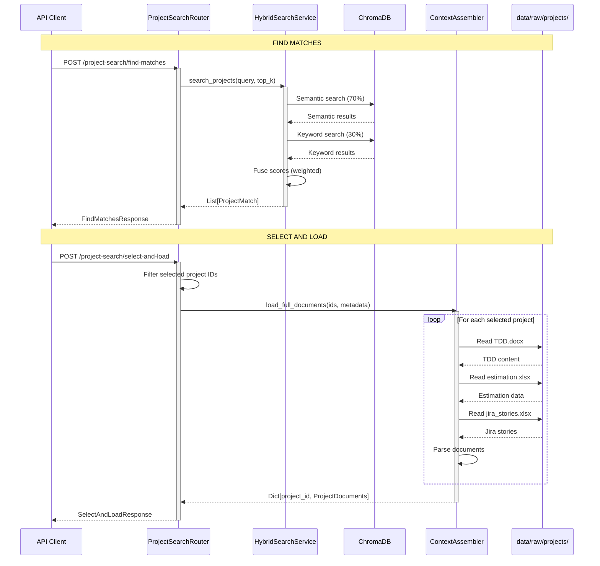

# Project Search Component

The **project_search** component provides on-demand search and document retrieval from the ChromaDB project index. It orchestrates **HybridSearchService** for semantic+keyword search and **ContextAssembler** for loading full project documents (TDD, Estimation, Jira Stories).

## Architecture Overview

```
┌─────────────────────────────────────────────────────────────────┐
│                  PROJECT SEARCH COMPONENT                        │
├─────────────────────────────────────────────────────────────────┤
│                                                                  │
│  ┌──────────────┐      ┌────────────────────┐                   │
│  │   Router     │─────▶│ HybridSearchService│                   │
│  │  (FastAPI)   │      │    (Singleton)     │                   │
│  └──────┬───────┘      └─────────┬──────────┘                   │
│         │                        │                               │
│         │                        ▼                               │
│         │           ┌────────────────────────┐                  │
│         │           │    VectorStoreManager  │                  │
│         │           │      (ChromaDB)        │                  │
│         │           └────────┬───────────────┘                  │
│         │                    │                                   │
│         │                    ▼                                   │
│         │           ┌────────────────────────┐                  │
│         │           │   project_index        │                  │
│         │           │   • Semantic search    │                  │
│         │           │   • Keyword search     │                  │
│         │           │   • Score fusion       │                  │
│         │           └────────────────────────┘                  │
│         │                                                        │
│         └──────────▶┌────────────────────┐                      │
│                     │  ContextAssembler  │                      │
│                     └─────────┬──────────┘                      │
│                              │                                   │
│                              ▼                                   │
│                     ┌────────────────────┐                      │
│                     │  Document Loaders  │                      │
│                     │  • TDD.docx        │                      │
│                     │  • estimation.xlsx │                      │
│                     │  • jira_stories.xlsx│                     │
│                     └────────────────────┘                      │
│                                                                  │
└─────────────────────────────────────────────────────────────────┘
```

## File Structure

```
project_search/
├── __init__.py      # Public exports
├── models.py        # Pydantic request/response schemas
├── router.py        # FastAPI search endpoints
└── README.md        # This file
```

**Note:** This component does NOT have a `service.py` file. It directly orchestrates:
- **HybridSearchService** (`app/rag/hybrid_search.py`) for searching
- **ContextAssembler** (`app/services/context_assembler.py`) for document loading

## Data Flow



## Models

### FindMatchesRequest

Request to search for similar projects.

```python
class FindMatchesRequest(BaseModel):
    """Request to find similar projects"""

    requirement_text: str    # User requirement to match
                            # Minimum 10 characters
                            # Example: "Real-time inventory tracking system with barcode scanning"

    top_k: int = 5          # Number of top matches to return (1-10)
                            # Default: 5
```

### FindMatchesResponse

Response with matching projects and scores.

```python
class FindMatchesResponse(BaseModel):
    """Response with top matching projects"""

    matches: List[ProjectMatch]    # List of matching projects
    total_matches: int             # Total number of matches returned
```

**ProjectMatch Structure** (from `app/rag/hybrid_search.py`):
```python
class ProjectMatch(BaseModel):
    project_id: str              # e.g., "PRJ-10051"
    project_name: str            # e.g., "Inventory Sync Automation"
    summary: str                 # Epic description from TDD
    match_score: float           # Final score (0-1)
    score_breakdown: ScoreBreakdown  # Semantic + keyword scores
    folder_path: str             # Path to project folder
    tdd_path: str | None         # Path to TDD.docx
    estimation_path: str | None  # Path to estimation.xlsx
    jira_stories_path: str | None  # Path to jira_stories.xlsx
```

**ScoreBreakdown Structure**:
```python
class ScoreBreakdown(BaseModel):
    semantic_score: float    # Semantic similarity (0-1)
    keyword_score: float     # Keyword match score (0-1)
```

### SelectAndLoadRequest

Request to load full documents for selected projects.

```python
class SelectAndLoadRequest(BaseModel):
    """Request to load full documents for selected projects"""

    selected_project_ids: List[str]    # 1-5 project IDs to load
                                      # Example: ["PRJ-10051", "PRJ-10052", "PRJ-10053"]

    project_metadata: List[ProjectMatch]  # Metadata from find-matches response
                                         # Contains file paths for loading
```

### SelectAndLoadResponse

Response with loaded project documents.

```python
class SelectAndLoadResponse(BaseModel):
    """Response with loaded project documents"""

    loaded_projects: Dict[str, Dict[str, Any]]  # Map of project_id -> documents
    projects_count: int                         # Number of projects loaded
```

**Loaded Documents Structure**:
```json
{
    "PRJ-10051": {
        "tdd": {
            "project_id": "PRJ-10051",
            "epic_description": "Automated inventory synchronization...",
            "module_list": ["Inventory Service", "Sync Engine"],
            "design_patterns": ["Event-Driven", "CQRS"],
            "architecture_pattern": "Microservices",
            "security_considerations": "OAuth 2.0 authentication..."
        },
        "estimation": {
            "total_dev_points": 160.0,
            "total_qa_points": 90.0,
            "task_breakdown": [
                {
                    "task_name": "Design database schema",
                    "dev_points": 8.0,
                    "qa_points": 4.0
                }
            ]
        },
        "jira_stories": {
            "stories": [
                {
                    "story_id": "STORY-001",
                    "title": "As a warehouse manager...",
                    "story_points": 8,
                    "acceptance_criteria": [...]
                }
            ]
        }
    }
}
```

## API Reference

### POST /api/v1/project-search/find-matches

Search for similar historical projects using hybrid search.

**Description:**
- Searches `project_index` collection with semantic + keyword fusion
- Returns top matching projects with score breakdown
- User can then select projects for full document loading

**Request:**
```bash
curl -X POST http://localhost:8000/api/v1/project-search/find-matches \
  -H "Content-Type: application/json" \
  -d '{
    "requirement_text": "Real-time inventory tracking with barcode scanning",
    "top_k": 5
  }'
```

**Response:**
```json
{
    "matches": [
        {
            "project_id": "PRJ-10051",
            "project_name": "Inventory Sync Automation",
            "summary": "This document describes an automated inventory synchronization system...",
            "match_score": 0.87,
            "score_breakdown": {
                "semantic_score": 0.85,
                "keyword_score": 0.92
            },
            "folder_path": "data/raw/projects/PRJ-10051-inventory-sync-automation",
            "tdd_path": "data/raw/projects/PRJ-10051-inventory-sync-automation/TDD.docx",
            "estimation_path": "data/raw/projects/PRJ-10051-inventory-sync-automation/estimation.xlsx",
            "jira_stories_path": "data/raw/projects/PRJ-10051-inventory-sync-automation/jira_stories.xlsx"
        },
        {
            "project_id": "PRJ-10052",
            "project_name": "Warehouse Management System",
            "match_score": 0.79,
            "score_breakdown": {
                "semantic_score": 0.76,
                "keyword_score": 0.85
            },
            "folder_path": "data/raw/projects/PRJ-10052-warehouse-mgmt",
            "tdd_path": "data/raw/projects/PRJ-10052-warehouse-mgmt/TDD.docx",
            "estimation_path": null,
            "jira_stories_path": null
        }
    ],
    "total_matches": 5
}
```

**Score Calculation:**
```
final_score = (semantic_score × 0.7) + (keyword_score × 0.3)

Example:
  semantic_score = 0.85
  keyword_score = 0.92
  final_score = (0.85 × 0.7) + (0.92 × 0.3)
              = 0.595 + 0.276
              = 0.871
```

**Status Codes:**
- `200 OK` - Search successful
- `500 INTERNAL SERVER ERROR` - Search failed

**Use Cases:**
- Frontend project discovery before creating session
- Manual project exploration
- Testing search quality
- Analyzing project similarity

---

### POST /api/v1/project-search/select-and-load

Load full documents (TDD, Estimation, Jira Stories) for selected projects.

**Description:**
- Loads and parses all documents for selected project IDs
- Returns structured JSON data ready for AI agents
- Typically used after `find-matches` to load top 3 projects

**Request:**
```bash
curl -X POST http://localhost:8000/api/v1/project-search/select-and-load \
  -H "Content-Type: application/json" \
  -d '{
    "selected_project_ids": ["PRJ-10051", "PRJ-10052", "PRJ-10053"],
    "project_metadata": [
        {
            "project_id": "PRJ-10051",
            "project_name": "Inventory Sync",
            "summary": "...",
            "match_score": 0.87,
            "score_breakdown": {"semantic_score": 0.85, "keyword_score": 0.92},
            "folder_path": "data/raw/projects/PRJ-10051-inventory-sync",
            "tdd_path": "data/raw/projects/PRJ-10051-inventory-sync/TDD.docx",
            "estimation_path": "data/raw/projects/PRJ-10051-inventory-sync/estimation.xlsx",
            "jira_stories_path": "data/raw/projects/PRJ-10051-inventory-sync/jira_stories.xlsx"
        }
    ]
  }'
```

**Response:**
```json
{
    "loaded_projects": {
        "PRJ-10051": {
            "tdd": { /* parsed TDD data */ },
            "estimation": { /* parsed estimation data */ },
            "jira_stories": { /* parsed stories data */ }
        },
        "PRJ-10052": {
            "tdd": { /* parsed TDD data */ },
            "estimation": null,
            "jira_stories": null
        },
        "PRJ-10053": {
            "tdd": { /* parsed TDD data */ },
            "estimation": { /* parsed estimation data */ },
            "jira_stories": { /* parsed stories data */ }
        }
    },
    "projects_count": 3
}
```

**Status Codes:**
- `200 OK` - Documents loaded successfully
- `404 NOT FOUND` - Project files not found
- `500 INTERNAL SERVER ERROR` - Failed to load or parse documents

**Use Cases:**
- Load context for AI agents after search
- Display full project details in UI
- Extract historical patterns for estimation
- Compare multiple projects side-by-side

## HybridSearchService

The project_search component relies on **HybridSearchService** (`app/rag/hybrid_search.py`).

### Key Methods

```python
class HybridSearchService:
    @classmethod
    def get_instance(cls) -> "HybridSearchService":
        """Thread-safe singleton instance"""

    async def search_projects(
        self,
        query: str,
        top_k: int = 5
    ) -> List[ProjectMatch]:
        """
        Search project_index collection with hybrid approach.

        Args:
            query: Requirement text to search
            top_k: Number of results to return

        Returns:
            List of ProjectMatch with scores and metadata
        """
```

### Hybrid Search Algorithm

```
┌─────────────────────────────────────────────────────────────────┐
│                    HYBRID SEARCH FLOW                            │
├─────────────────────────────────────────────────────────────────┤
│                                                                  │
│  1. Semantic Search (70% weight)                                │
│     • Generate query embedding with Ollama                      │
│     • ChromaDB cosine similarity search                         │
│     • Returns semantic_score (0-1)                              │
│                                                                  │
│  2. Keyword Search (30% weight)                                 │
│     • Extract keywords from query                               │
│     • BM25 algorithm on metadata                                │
│     • Returns keyword_score (0-1)                               │
│                                                                  │
│  3. Score Fusion                                                │
│     • final_score = (sem × 0.7) + (kw × 0.3)                    │
│     • Rank by final_score descending                            │
│     • Return top_k results                                      │
│                                                                  │
└─────────────────────────────────────────────────────────────────┘
```

**Configuration:**
```python
from app.components.base.config import get_settings

settings = get_settings()
# settings.search_semantic_weight = 0.7
# settings.search_keyword_weight = 0.3
```

## ContextAssembler

The `select-and-load` endpoint uses **ContextAssembler** (`app/services/context_assembler.py`).

### Key Methods

```python
class ContextAssembler:
    async def load_full_documents(
        self,
        project_ids: List[str],
        project_metadata: List[ProjectMetadata]
    ) -> Dict[str, ProjectDocuments]:
        """
        Load and parse all documents for selected projects.

        Args:
            project_ids: List of project IDs to load
            project_metadata: Metadata with file paths

        Returns:
            Dict mapping project_id to parsed documents

        Raises:
            FileNotFoundError: Document files not found
        """
```

### Document Parsers

ContextAssembler uses specialized parsers for each document type:

- **TDD Parser**: Extracts structured data from TDD.docx
  - Epic description
  - Module list
  - Design patterns
  - Architecture pattern
  - Security considerations

- **Estimation Parser**: Extracts effort data from estimation.xlsx
  - Total dev points
  - Total QA points
  - Task breakdown with individual estimates

- **Jira Parser**: Extracts user stories from jira_stories.xlsx
  - Story ID
  - Title
  - Story points
  - Acceptance criteria

## Workflow Integration

The project_search component supports two workflows:

### 1. Standalone Search (Without Session)

```
User → find-matches → select-and-load → Manual Review
```

**Use Case:** Frontend project browser, exploration, testing

---

### 2. Pipeline Integration (With Session)

```
Session → historical_match agent → auto_select → impacted_modules → ...
```

**Note:** The historical_match **agent** (`app/components/historical_match/`) is used in the LangGraph pipeline, NOT this component. This component is for **standalone, on-demand** search outside the pipeline.

## Comparison: project_search vs historical_match

| Aspect | project_search | historical_match |
|--------|----------------|------------------|
| **Type** | Standalone API endpoints | LangGraph agent in pipeline |
| **Usage** | On-demand search | Pipeline execution |
| **Session** | Optional | Required |
| **Context** | User-initiated | Workflow-driven |
| **Output** | HTTP response | State update |
| **Audit Trail** | No session logging | Full audit trail |
| **Frontend** | Project browser | Assessment wizard |

Both use **HybridSearchService** internally for search.

## Error Handling

The router implements comprehensive error handling:

```python
# Find matches errors
try:
    matches = await search_service.search_projects(query, top_k)
except Exception as e:
    logger.error(f"Error finding matches: {e}", exc_info=True)
    raise HTTPException(
        status_code=status.HTTP_500_INTERNAL_SERVER_ERROR,
        detail=f"Failed to search projects: {str(e)}"
    )

# Select and load errors
try:
    loaded = await assembler.load_full_documents(ids, metadata)
except FileNotFoundError as e:
    raise HTTPException(
        status_code=status.HTTP_404_NOT_FOUND,
        detail=f"Project files not found: {str(e)}"
    )
except Exception as e:
    raise HTTPException(
        status_code=status.HTTP_500_INTERNAL_SERVER_ERROR,
        detail=f"Failed to load projects: {str(e)}"
    )
```

## Logging

Search operations are logged with context:

```python
import logging
logger = logging.getLogger(__name__)

# Examples:
logger.info(f"Searching for similar projects: {requirement_text[:100]}...")
logger.info(f"Found {len(matches)} matching projects")
logger.info(f"Loading documents for {len(selected_ids)} projects")
logger.info(f"Successfully loaded {len(loaded_projects)} projects")
logger.error(f"Error finding matches: {e}", exc_info=True)
```

## Configuration

Settings from `app/components/base/config.py`:

```python
from app.components.base.config import get_settings

settings = get_settings()
# settings.search_semantic_weight - Semantic search weight (default: 0.7)
# settings.search_keyword_weight - Keyword search weight (default: 0.3)
# settings.chroma_persist_dir - ChromaDB storage location
# settings.ollama_embed_model - Embedding model name
```

**Environment Variables:**
```bash
# .env file
SEARCH_SEMANTIC_WEIGHT=0.7
SEARCH_KEYWORD_WEIGHT=0.3
CHROMA_PERSIST_DIR=./data/chroma
OLLAMA_EMBED_MODEL=all-minilm
```

## Troubleshooting

### Issue: Find matches returns no results

**Cause:**
- Empty project_index collection
- Embedding service not running
- Query too specific or uses incorrect terminology

**Solution:**
```bash
# Check index status
curl http://localhost:8000/api/v1/admin/index/status

# Rebuild index if empty
curl -X POST http://localhost:8000/api/v1/admin/index/rebuild

# Verify Ollama is running
curl http://localhost:11434/api/tags

# Try broader search query
curl -X POST http://localhost:8000/api/v1/project-search/find-matches \
  -d '{"requirement_text": "inventory management", "top_k": 10}'
```

---

### Issue: Select and load fails with FileNotFoundError

**Cause:**
- Project files moved or deleted after indexing
- Incorrect file paths in metadata
- File permissions issue

**Solution:**
```bash
# Verify project files exist
ls data/raw/projects/PRJ-10051-*/TDD.docx

# Check file paths in metadata
curl -X POST http://localhost:8000/api/v1/project-search/find-matches \
  -d '{"requirement_text": "test", "top_k": 1}' | jq '.matches[0].tdd_path'

# Rebuild index to refresh file paths
curl -X POST http://localhost:8000/api/v1/admin/index/rebuild
```

---

### Issue: Low match scores for relevant projects

**Cause:**
- Semantic embeddings not capturing domain terminology
- Keyword mismatch
- Weight configuration favoring wrong search type

**Solution:**
```bash
# Adjust search weights (favor keywords)
export SEARCH_SEMANTIC_WEIGHT=0.5
export SEARCH_KEYWORD_WEIGHT=0.5

# Use more specific terminology
# ❌ "system for tracking items"
# ✅ "inventory tracking with barcode scanning and real-time sync"

# Check score breakdown to diagnose
curl -X POST http://localhost:8000/api/v1/project-search/find-matches \
  -d '{"requirement_text": "...", "top_k": 5}' | jq '.matches[].score_breakdown'
```

---

### Issue: Document parsing fails

**Cause:**
- Corrupted DOCX/XLSX files
- Unexpected document format
- Missing required sections in TDD

**Solution:**
```bash
# Check document integrity
file data/raw/projects/PRJ-10051-*/TDD.docx

# Validate TDD structure manually
python scripts/validate_tdd.py data/raw/projects/PRJ-10051-*/TDD.docx

# Check error logs for specific parsing issues
tail -f logs/app.log | grep "ContextAssembler"
```

## Best Practices

1. **Search Query Quality**: Use descriptive, domain-specific terms for better matches
2. **Top K Selection**: Request 5-10 results for find-matches, select top 3 for loading
3. **Score Analysis**: Review `score_breakdown` to understand match quality
4. **Error Handling**: Always handle 404/500 errors when files may be missing
5. **Performance**: Avoid loading too many projects simultaneously (limit 1-5)
6. **Metadata Accuracy**: Keep project_index current with admin rebuild

## Performance Considerations

### Find Matches Performance

- **Semantic Search**: ~100-200ms (Ollama embedding + ChromaDB query)
- **Keyword Search**: ~50-100ms (BM25 algorithm)
- **Total**: ~150-300ms for 5 results

### Select and Load Performance

- **Per Project**: ~500ms-2s (depends on file sizes)
- **3 Projects**: ~1.5-6s total
- **Bottleneck**: DOCX/XLSX parsing (CPU-bound)

**Optimization Tips:**
- Load documents in parallel (already implemented)
- Cache frequently accessed projects
- Pre-parse documents during indexing (future enhancement)

## Related Components

- **admin** (`app/components/admin/`) - Index management
- **historical_match** (`app/components/historical_match/`) - Pipeline search agent
- **HybridSearchService** (`app/rag/hybrid_search.py`) - Search algorithm
- **ContextAssembler** (`app/services/context_assembler.py`) - Document loading
- **VectorStoreManager** (`app/rag/vector_store.py`) - ChromaDB wrapper

## Future Enhancements

Potential improvements for the project_search component:

1. **Pagination**: Support offset/limit for large result sets
2. **Filtering**: Filter by project date, size, technology stack
3. **Faceted Search**: Search within specific document sections
4. **Caching**: Cache frequently loaded projects
5. **Async Loading**: Stream documents as they're parsed
6. **Preview Mode**: Load document summaries before full documents
7. **Search History**: Track and optimize common queries
8. **Relevance Feedback**: User ratings to improve search quality
