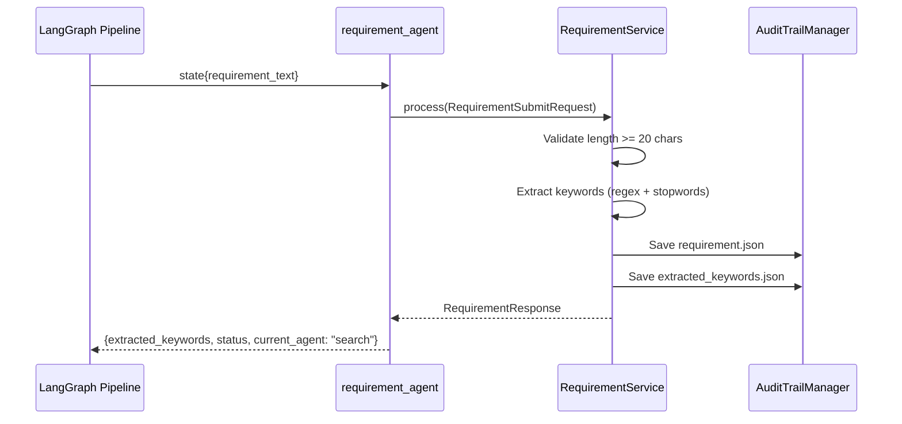

# Requirement Component

The **requirement** component handles the intake and preprocessing of software requirements. It validates input text, extracts keywords for search optimization, and serves as the entry point for the impact assessment pipeline.

## Architecture Overview

```
┌─────────────────────────────────────────────────────────────────┐
│                   REQUIREMENT COMPONENT                          │
├─────────────────────────────────────────────────────────────────┤
│                                                                  │
│  ┌──────────────┐      ┌───────────────────┐                    │
│  │   Router     │─────▶│RequirementService │                    │
│  │  (FastAPI)   │      │  (BaseComponent)  │                    │
│  └──────────────┘      └─────────┬─────────┘                    │
│                                  │                               │
│  ┌──────────────┐                │                               │
│  │   Agent      │◀───────────────┤                               │
│  │ (LangGraph)  │                │                               │
│  └──────────────┘                ▼                               │
│                        ┌─────────────────────┐                   │
│                        │  Keyword Extraction │                   │
│                        │  • Regex tokenizing │                   │
│                        │  • Stopword removal │                   │
│                        │  • Deduplication    │                   │
│                        └─────────────────────┘                   │
│                                  │                               │
│                                  ▼                               │
│                        ┌─────────────────────┐                   │
│                        │    Audit Trail      │                   │
│                        │  step1_input/       │                   │
│                        └─────────────────────┘                   │
│                                                                  │
└─────────────────────────────────────────────────────────────────┘
```

## File Structure

```
requirement/
├── __init__.py      # Public exports
├── models.py        # Pydantic request/response schemas
├── service.py       # Requirement processing and keyword extraction
├── agent.py         # LangGraph node wrapper
├── router.py        # FastAPI endpoints
└── README.md        # This file
```

## Data Flow



## Code Walkthrough

### 1. Models (`models.py`)

Defines the data contracts for requirement processing.

```python
from pydantic import BaseModel, Field
from typing import Optional, List
from datetime import datetime

class RequirementSubmitRequest(BaseModel):
    """Request to submit a requirement."""
    session_id: str
    requirement_description: str = Field(..., min_length=20)
    jira_epic_id: Optional[str] = None

class RequirementResponse(BaseModel):
    """Response after requirement submission."""
    session_id: str
    requirement_id: str
    status: str
    character_count: int
    extracted_keywords: List[str]
    created_at: datetime
```

**Validation Rules:**

| Field | Constraint | Purpose |
|-------|------------|---------|
| `requirement_description` | `min_length=20` | Ensures meaningful input |
| `session_id` | Required | Links to session lifecycle |
| `jira_epic_id` | Optional | Traceability to external systems |

---

### 2. Service (`service.py`)

The core business logic for requirement processing.

```python
import re
from typing import List
from app.components.base.component import BaseComponent
from app.components.base.exceptions import RequirementTooShortError

class RequirementService(BaseComponent[RequirementSubmitRequest, RequirementResponse]):
    """Process and validate requirements."""

    STOPWORDS = {
        "that", "this", "with", "from", "have", "will", "should", "would",
        "could", "must", "need", "want", "like", "make", "create", "update",
        "the", "and", "for", "are", "but", "not", "you", "all", "can", "her",
    }

    @property
    def component_name(self) -> str:
        return "requirement"
```

**Process Method:**

```python
async def process(self, request: RequirementSubmitRequest) -> RequirementResponse:
    """Process submitted requirement."""
    # Validation
    if len(request.requirement_description) < 20:
        raise RequirementTooShortError(
            "Requirement must be at least 20 characters",
            component="requirement",
        )

    # Extract keywords
    keywords = self._extract_keywords(request.requirement_description)

    # Save to audit trail
    audit = AuditTrailManager(request.session_id)
    audit.save_json(
        "requirement.json",
        {
            "requirement_description": request.requirement_description,
            "jira_epic_id": request.jira_epic_id,
        },
        subfolder="step1_input",
    )
    audit.save_json(
        "extracted_keywords.json",
        {"keywords": keywords},
        subfolder="step1_input",
    )
    audit.add_step_completed("requirement_submitted")

    return RequirementResponse(
        session_id=request.session_id,
        requirement_id=f"req_{request.session_id}",
        status="submitted",
        character_count=len(request.requirement_description),
        extracted_keywords=keywords,
        created_at=datetime.now(),
    )
```

**Keyword Extraction Algorithm:**

```python
def _extract_keywords(self, text: str) -> List[str]:
    """Extract keywords from requirement text."""
    # Step 1: Find all words with 4+ characters
    words = re.findall(r"\b[a-zA-Z]{4,}\b", text.lower())

    # Step 2: Remove stopwords
    filtered = [w for w in words if w not in self.STOPWORDS]

    # Step 3: Deduplicate while preserving order, limit to 20
    return list(dict.fromkeys(filtered))[:20]
```

**Algorithm Breakdown:**

| Step | Operation | Example |
|------|-----------|---------|
| 1 | Regex extraction | `"Build API for users"` → `["Build", "users"]` |
| 2 | Lowercasing | `["build", "users"]` |
| 3 | Stopword removal | `["build", "the", "users"]` → `["build", "users"]` |
| 4 | Deduplication | `["build", "build", "users"]` → `["build", "users"]` |
| 5 | Limit | Max 20 keywords |

---

### 3. Agent (`agent.py`)

LangGraph node that wraps the service for workflow integration.

```python
from typing import Dict, Any
from .service import RequirementService
from .models import RequirementSubmitRequest

_service: RequirementService | None = None

def get_service() -> RequirementService:
    """Singleton service factory."""
    global _service
    if _service is None:
        _service = RequirementService()
    return _service

async def requirement_agent(state: Dict[str, Any]) -> Dict[str, Any]:
    """LangGraph node for requirement processing.

    Returns PARTIAL state update - only changed fields.
    """
    try:
        service = get_service()

        request = RequirementSubmitRequest(
            session_id=state["session_id"],
            requirement_description=state["requirement_text"],
            jira_epic_id=state.get("jira_epic_id"),
        )

        response = await service.process(request)

        return {
            "extracted_keywords": response.extracted_keywords,
            "status": "requirement_submitted",
            "current_agent": "search",  # Next node in workflow
            "messages": [
                {
                    "role": "requirement",
                    "content": f"Extracted {len(response.extracted_keywords)} keywords",
                }
            ],
        }

    except Exception as e:
        return {
            "status": "error",
            "error_message": str(e),
            "current_agent": "error_handler",
        }
```

**Key Pattern - Partial State Updates:**

LangGraph nodes return only the fields that changed. The framework merges these into the full state automatically.

```python
# Input state (full):
{
    "session_id": "sess_123",
    "requirement_text": "Build user auth...",
    "status": "created",
    "current_agent": "requirement",
    ...
}

# Agent returns (partial):
{
    "extracted_keywords": ["user", "auth", ...],
    "status": "requirement_submitted",
    "current_agent": "search",
    "messages": [...]
}

# Result (merged):
{
    "session_id": "sess_123",           # preserved
    "requirement_text": "Build user...", # preserved
    "extracted_keywords": [...],         # updated
    "status": "requirement_submitted",   # updated
    "current_agent": "search",           # updated
    ...
}
```

---

### 4. Router (`router.py`)

FastAPI endpoint for direct HTTP access.

```python
from fastapi import APIRouter, Depends, HTTPException
from app.components.base.exceptions import ComponentError

router = APIRouter(prefix="/requirement", tags=["Requirement"])

@router.post("/submit", response_model=RequirementResponse)
async def submit_requirement(
    request: RequirementSubmitRequest,
    service: RequirementService = Depends(get_service),
) -> RequirementResponse:
    """Submit a requirement for analysis."""
    try:
        return await service.process(request)
    except ComponentError as e:
        raise HTTPException(status_code=400, detail=e.to_dict())
```

---

## API Reference

### Endpoints

| Method | Path | Description | Response |
|--------|------|-------------|----------|
| `POST` | `/requirement/submit` | Submit requirement for analysis | `RequirementResponse` |

### Request/Response Examples

**Submit Requirement:**

```bash
curl -X POST http://localhost:8000/requirement/submit \
  -H "Content-Type: application/json" \
  -d '{
    "session_id": "sess_20240115_103045_a1b2c3",
    "requirement_description": "Build a user authentication system with OAuth2 support, including login, logout, and password reset functionality for the mobile application.",
    "jira_epic_id": "PROJ-1234"
  }'
```

Response:
```json
{
  "session_id": "sess_20240115_103045_a1b2c3",
  "requirement_id": "req_sess_20240115_103045_a1b2c3",
  "status": "submitted",
  "character_count": 156,
  "extracted_keywords": [
    "build",
    "user",
    "authentication",
    "system",
    "oauth2",
    "support",
    "including",
    "login",
    "logout",
    "password",
    "reset",
    "functionality",
    "mobile",
    "application"
  ],
  "created_at": "2024-01-15T10:30:45.123456"
}
```

---

## Audit Trail Output

After processing, the following files are created:

```
data/sessions/2024-01-15/sess_20240115_103045_a1b2c3/
└── step1_input/
    ├── requirement.json
    └── extracted_keywords.json
```

**requirement.json:**
```json
{
  "requirement_description": "Build a user authentication system...",
  "jira_epic_id": "PROJ-1234"
}
```

**extracted_keywords.json:**
```json
{
  "keywords": ["build", "user", "authentication", "system", ...]
}
```

---

## Integration with Pipeline

The requirement component is the **entry point** for the LangGraph workflow:

```
┌─────────────────────────────────────────────────────────────┐
│                    WORKFLOW POSITION                         │
├─────────────────────────────────────────────────────────────┤
│                                                              │
│  ┌─────────────┐      ┌──────────┐      ┌──────────┐        │
│  │ requirement │─────▶│  search  │─────▶│  modules │──▶...  │
│  │   (START)   │      │          │      │          │        │
│  └─────────────┘      └──────────┘      └──────────┘        │
│                                                              │
│  Sets: extracted_keywords                                    │
│  Next: current_agent = "search"                              │
│                                                              │
└─────────────────────────────────────────────────────────────┘
```

---

## Examples

### Using the Service Directly

```python
from app.components.requirement import RequirementService, RequirementSubmitRequest

service = RequirementService()
request = RequirementSubmitRequest(
    session_id="sess_test_123",
    requirement_description="Implement real-time notifications using WebSocket connections for the dashboard application.",
    jira_epic_id="DASH-456"
)

response = await service.process(request)
print(f"Extracted {len(response.extracted_keywords)} keywords")
print(f"Keywords: {response.extracted_keywords}")
```

### Custom Stopword List

```python
# Extend the default stopwords
class CustomRequirementService(RequirementService):
    STOPWORDS = RequirementService.STOPWORDS | {
        "application", "system", "implement", "develop"
    }
```

---

## Troubleshooting

| Issue | Cause | Solution |
|-------|-------|----------|
| `RequirementTooShortError` | Input < 20 characters | Provide more detailed requirement |
| `Empty keywords list` | All words filtered as stopwords | Review stopword list, add domain terms |
| `Validation error` | Missing `session_id` | Ensure session created first |
| `Audit files missing` | Directory permissions | Check write access to `data/sessions/` |

---

## Best Practices

1. **Write detailed requirements** - More context = better keyword extraction = better search results
2. **Include technical terms** - Domain-specific words improve semantic matching
3. **Link to Jira** - Use `jira_epic_id` for traceability
4. **Review extracted keywords** - Check audit trail to verify extraction quality
5. **Consider extending stopwords** - Add project-specific common words to improve signal
