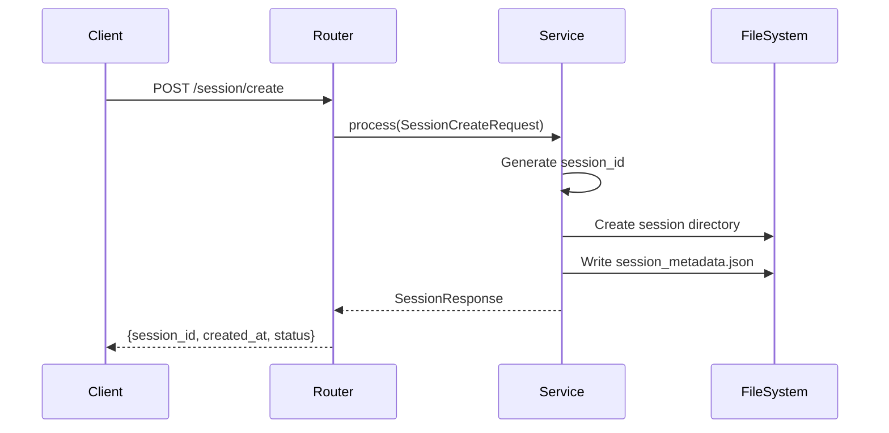

# Session Component

The **session** component manages the lifecycle of impact assessment sessions. It creates unique session identifiers, maintains session state, and provides a complete audit trail for each assessment run.

## Architecture Overview

```
┌─────────────────────────────────────────────────────────────────┐
│                     SESSION COMPONENT                            │
├─────────────────────────────────────────────────────────────────┤
│                                                                  │
│  ┌──────────────┐      ┌──────────────────┐                     │
│  │   Router     │─────▶│  SessionService  │                     │
│  │  (FastAPI)   │      │  (BaseComponent) │                     │
│  └──────────────┘      └────────┬─────────┘                     │
│                                 │                                │
│                                 │ manages                        │
│                                 ▼                                │
│  ┌──────────────────────────────────────────────────────┐       │
│  │              FILE SYSTEM STORAGE                      │       │
│  │                                                       │       │
│  │  data/sessions/                                       │       │
│  │  └── 2024-01-15/                                      │       │
│  │      └── sess_20240115_103045_a1b2c3/                │       │
│  │          └── session_metadata.json                    │       │
│  │                                                       │       │
│  └──────────────────────────────────────────────────────┘       │
│                                                                  │
└─────────────────────────────────────────────────────────────────┘
```

## File Structure

```
session/
├── __init__.py      # Public exports
├── models.py        # Pydantic request/response schemas
├── service.py       # Session lifecycle management
├── router.py        # FastAPI endpoints
└── README.md        # This file
```

## Data Flow



## Code Walkthrough

### 1. Models (`models.py`)

Defines the data contracts for session operations.

```python
from pydantic import BaseModel
from typing import Optional, List, Dict
from datetime import datetime

class SessionCreateRequest(BaseModel):
    """Request to create a new assessment session."""
    user_id: Optional[str] = None

class SessionResponse(BaseModel):
    """Session details response."""
    session_id: str
    created_at: datetime
    status: str
    audit_path: str
    user_id: Optional[str] = None

class SessionAuditResponse(BaseModel):
    """Full audit trail for a session."""
    session_id: str
    created_at: datetime
    status: str
    steps_completed: List[str]
    timing: Dict[str, int]
    data: Dict
```

**Model Relationships:**

| Model | Purpose | Used By |
|-------|---------|---------|
| `SessionCreateRequest` | Input for new session | `POST /session/create` |
| `SessionResponse` | Basic session info | All session endpoints |
| `SessionAuditResponse` | Full audit trail | `GET /session/{id}/audit` |

---

### 2. Service (`service.py`)

The core business logic for session management.

```python
import secrets
from datetime import datetime
from pathlib import Path

class SessionService(BaseComponent[SessionCreateRequest, SessionResponse]):
    """Session lifecycle management as a component."""

    def __init__(self):
        self.config = get_settings()
        self.sessions_path = Path(self.config.data_sessions_path)

    @property
    def component_name(self) -> str:
        return "session"
```

**Session ID Generation:**

```python
async def process(self, request: SessionCreateRequest) -> SessionResponse:
    now = datetime.now()
    random_suffix = secrets.token_hex(3)  # 6 random hex chars
    session_id = f"sess_{now.strftime('%Y%m%d')}_{now.strftime('%H%M%S')}_{random_suffix}"
    # Example: sess_20240115_103045_a1b2c3
```

**Key Design Decision:** Session IDs are designed to be:
- **Human-readable** - Contains date/time for quick identification
- **Unique** - Random suffix prevents collisions
- **Sortable** - Chronological ordering by name

**Directory Structure Creation:**

```python
    date_folder = now.strftime("%Y-%m-%d")
    session_dir = self.sessions_path / date_folder / session_id
    session_dir.mkdir(parents=True, exist_ok=True)
```

This creates:
```
data/sessions/
└── 2024-01-15/           # Date-based organization
    └── sess_20240115_103045_a1b2c3/
        └── session_metadata.json
```

**Metadata Storage:**

```python
    metadata = {
        "session_id": session_id,
        "created_at": now.isoformat(),
        "status": "created",
        "user_id": request.user_id,
        "steps_completed": [],
        "timing": {},
    }
    self._save_metadata(session_dir, metadata)
```

**Session Retrieval:**

```python
async def get_session(self, session_id: str) -> SessionResponse:
    """Retrieve session by ID."""
    session_dir = self._find_session_dir(session_id)
    if not session_dir:
        raise SessionNotFoundError(
            f"Session {session_id} not found",
            component="session"
        )
    metadata = self._load_metadata(session_dir)
    return SessionResponse(
        session_id=metadata["session_id"],
        created_at=datetime.fromisoformat(metadata["created_at"]),
        status=metadata["status"],
        audit_path=str(session_dir),
        user_id=metadata.get("user_id"),
    )
```

**Session Directory Search:**

```python
def _find_session_dir(self, session_id: str) -> Optional[Path]:
    """Find session directory by ID."""
    for date_folder in self.sessions_path.iterdir():
        if date_folder.is_dir():
            session_dir = date_folder / session_id
            if session_dir.exists():
                return session_dir
    return None
```

This search iterates through date folders to find the session. For production systems with many sessions, consider adding an index or database lookup.

---

### 3. Router (`router.py`)

FastAPI endpoints for session operations.

```python
from fastapi import APIRouter, Depends, HTTPException

router = APIRouter(prefix="/session", tags=["Session"])

_service: SessionService | None = None

def get_service() -> SessionService:
    """Singleton service factory."""
    global _service
    if _service is None:
        _service = SessionService()
    return _service
```

**Singleton Pattern:** The `get_service()` function implements lazy initialization to ensure only one `SessionService` instance exists.

**Create Session Endpoint:**

```python
@router.post("/create", response_model=SessionResponse)
async def create_session(
    request: SessionCreateRequest,
    service: SessionService = Depends(get_service),
) -> SessionResponse:
    """Create a new assessment session."""
    return await service.process(request)
```

**Get Session Endpoint:**

```python
@router.get("/{session_id}", response_model=SessionResponse)
async def get_session(
    session_id: str,
    service: SessionService = Depends(get_service),
) -> SessionResponse:
    """Get session details."""
    try:
        return await service.get_session(session_id)
    except ComponentError as e:
        raise HTTPException(status_code=404, detail=e.to_dict())
```

**Get Audit Trail Endpoint:**

```python
@router.get("/{session_id}/audit", response_model=SessionAuditResponse)
async def get_session_audit(
    session_id: str,
    service: SessionService = Depends(get_service),
) -> SessionAuditResponse:
    """Get full audit trail for a session."""
    try:
        return await service.get_audit(session_id)
    except ComponentError as e:
        raise HTTPException(status_code=404, detail=e.to_dict())
```

---

## API Reference

### Endpoints

| Method | Path | Description | Response |
|--------|------|-------------|----------|
| `POST` | `/session/create` | Create new session | `SessionResponse` |
| `GET` | `/session/{session_id}` | Get session details | `SessionResponse` |
| `GET` | `/session/{session_id}/audit` | Get full audit trail | `SessionAuditResponse` |

### Request/Response Examples

**Create Session:**

```bash
curl -X POST http://localhost:8000/session/create \
  -H "Content-Type: application/json" \
  -d '{"user_id": "developer@example.com"}'
```

Response:
```json
{
  "session_id": "sess_20240115_103045_a1b2c3",
  "created_at": "2024-01-15T10:30:45.123456",
  "status": "created",
  "audit_path": "data/sessions/2024-01-15/sess_20240115_103045_a1b2c3",
  "user_id": "developer@example.com"
}
```

**Get Session:**

```bash
curl http://localhost:8000/session/sess_20240115_103045_a1b2c3
```

**Get Audit Trail:**

```bash
curl http://localhost:8000/session/sess_20240115_103045_a1b2c3/audit
```

Response:
```json
{
  "session_id": "sess_20240115_103045_a1b2c3",
  "created_at": "2024-01-15T10:30:45.123456",
  "status": "completed",
  "steps_completed": [
    "requirement_submitted",
    "matches_selected",
    "modules_generated",
    "effort_estimated",
    "stories_generated",
    "code_impact_analyzed",
    "risks_identified"
  ],
  "timing": {
    "search_ms": 1250,
    "modules_ms": 3200,
    "effort_ms": 2800
  },
  "data": { ... }
}
```

---

## Session Lifecycle

```
┌─────────────────────────────────────────────────────────────┐
│                    SESSION STATES                            │
├─────────────────────────────────────────────────────────────┤
│                                                              │
│  ┌─────────┐     ┌─────────────────┐     ┌─────────────┐   │
│  │ created │────▶│ requirement_    │────▶│ matches_    │   │
│  │         │     │ submitted       │     │ found       │   │
│  └─────────┘     └─────────────────┘     └──────┬──────┘   │
│                                                  │          │
│                                                  ▼          │
│  ┌──────────┐    ┌─────────────────┐    ┌──────────────┐   │
│  │completed │◀───│ generating_     │◀───│ matches_     │   │
│  │          │    │ impact          │    │ selected     │   │
│  └──────────┘    └─────────────────┘    └──────────────┘   │
│       │                                                     │
│       │ (error at any step)                                 │
│       ▼                                                     │
│  ┌─────────┐                                                │
│  │  error  │                                                │
│  └─────────┘                                                │
│                                                              │
└─────────────────────────────────────────────────────────────┘
```

---

## Examples

### Creating a Session Programmatically

```python
from app.components.session import SessionService, SessionCreateRequest

service = SessionService()
request = SessionCreateRequest(user_id="analyst@company.com")
response = await service.process(request)

print(f"Created session: {response.session_id}")
print(f"Audit path: {response.audit_path}")
```

### Updating Session Status

```python
# From another component
await session_service.update_status(
    session_id="sess_20240115_103045_a1b2c3",
    status="generating_impact"
)
```

### Checking Session Audit

```python
audit = await service.get_audit("sess_20240115_103045_a1b2c3")
print(f"Steps completed: {audit.steps_completed}")
print(f"Timing breakdown: {audit.timing}")
```

---

## Troubleshooting

| Issue | Cause | Solution |
|-------|-------|----------|
| `SessionNotFoundError` | Invalid session ID | Verify session ID format |
| `Permission denied` | File system permissions | Check `data/sessions/` write access |
| `Session directory not created` | Missing parent directory | Ensure `data/sessions/` exists |
| `JSON decode error` | Corrupted metadata file | Check `session_metadata.json` |

---

## Best Practices

1. **Always check session exists** before referencing in other components
2. **Use audit trail** for debugging pipeline issues
3. **Clean up old sessions** - Implement retention policy for date folders
4. **Handle concurrent access** - File-based storage isn't ideal for high concurrency
5. **Include user_id** when possible for traceability
