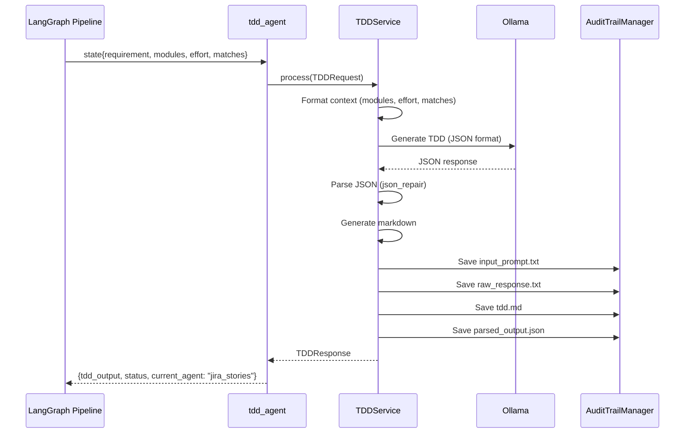

# TDD Component

The **tdd** component generates comprehensive Technical Design Documents (TDDs) using LLM-based analysis. It synthesizes requirement descriptions, impacted modules, effort estimates, and historical project data into structured technical designs with architecture patterns, component specifications, and implementation guidance.

## Architecture Overview

```
┌─────────────────────────────────────────────────────────────────┐
│                        TDD COMPONENT                             │
├─────────────────────────────────────────────────────────────────┤
│                                                                  │
│  ┌──────────────┐      ┌───────────────────┐                    │
│  │   Router     │─────▶│    TDDService     │                    │
│  │  (FastAPI)   │      │  (BaseComponent)  │                    │
│  └──────────────┘      └─────────┬─────────┘                    │
│                                  │                               │
│  ┌──────────────┐                │                               │
│  │   Agent      │◀───────────────┤                               │
│  │ (LangGraph)  │                │                               │
│  └──────────────┘                ▼                               │
│                        ┌─────────────────────┐                   │
│                        │   LLM Generation    │                   │
│                        │  • Ollama (phi3)    │                   │
│                        │  • JSON format      │                   │
│                        │  • Structured TDD   │                   │
│                        └─────────┬───────────┘                   │
│                                  │                               │
│                                  ▼                               │
│                        ┌─────────────────────┐                   │
│                        │  Markdown Generator │                   │
│                        │  • Format template  │                   │
│                        │  • Save tdd.md      │                   │
│                        └─────────────────────┘                   │
│                                  │                               │
│                                  ▼                               │
│                        ┌─────────────────────┐                   │
│                        │    Audit Trail      │                   │
│                        │ step3_agents/       │                   │
│                        │   agent_tdd/        │                   │
│                        └─────────────────────┘                   │
│                                                                  │
└─────────────────────────────────────────────────────────────────┘
```

## File Structure

```
tdd/
├── __init__.py      # Public exports
├── models.py        # Pydantic request/response schemas
├── service.py       # TDD generation and markdown formatting
├── agent.py         # LangGraph node wrapper
├── router.py        # FastAPI endpoints
├── prompts.py       # LLM system/user prompts + markdown template
└── README.md        # This file
```

## Data Flow



## Code Walkthrough

### 1. Models (`models.py`)

Defines the data contracts for TDD generation.

```python
from pydantic import BaseModel, Field
from typing import List, Dict, Optional
from datetime import datetime


class TDDRequest(BaseModel):
    """Request to generate TDD document."""
    session_id: str
    requirement_text: str
    selected_matches: List[Dict]  # Historical projects
    impacted_modules_output: Dict  # From modules agent
    estimation_effort_output: Dict  # From effort agent


class TDDResponse(BaseModel):
    """Response with generated TDD document."""
    session_id: str
    agent: str = "tdd"
    tdd_name: str
    tdd_description: str  # 2-3 paragraph overview
    technical_components: List[str]  # Technologies, frameworks
    design_decisions: str  # Architectural choices
    architecture_pattern: str  # e.g., Microservices, Event-Driven
    security_considerations: str  # Security requirements
    performance_requirements: str  # SLAs, response times
    tdd_dependencies: List[str]  # Dependent services
    markdown_content: str  # Full markdown document
    markdown_file_path: Optional[str]  # Path to saved .md file
    generated_at: datetime
```

**Field Descriptions:**

| Field | Purpose | Example |
|-------|---------|---------|
| `tdd_name` | Descriptive title | "User Authentication System with OAuth2" |
| `tdd_description` | Detailed technical overview | "This system implements..." |
| `technical_components` | Technology stack | `["FastAPI", "PostgreSQL", "Redis"]` |
| `design_decisions` | Architectural rationale | "Using JWT for stateless auth because..." |
| `architecture_pattern` | Design pattern | "Adapter Pattern", "CQRS" |
| `security_considerations` | Security requirements | "OAuth2 scopes, HTTPS only, rate limiting" |
| `performance_requirements` | SLA specs | "< 200ms p95 latency, 1000 req/sec" |
| `tdd_dependencies` | External dependencies | `["User Service", "Email Service"]` |

---

### 2. Service (`service.py`)

The core business logic for TDD generation.

```python
from app.components.base.component import BaseComponent
from app.utils.ollama_client import get_ollama_client
from app.utils.json_repair import parse_llm_json
from app.utils.audit import AuditTrailManager


class TDDService(BaseComponent[TDDRequest, TDDResponse]):
    """TDD generation agent as a component."""

    def __init__(self):
        self.ollama = get_ollama_client()

    @property
    def component_name(self) -> str:
        return "tdd"
```

**Process Method:**

```python
async def process(self, request: TDDRequest) -> TDDResponse:
    """Generate TDD document using LLM."""

    # 1. Format context from previous agents
    modules_summary = self._format_modules(request.impacted_modules_output)
    effort_summary = self._format_effort(request.estimation_effort_output)
    historical_matches = self._format_matches(request.selected_matches)

    # 2. Build prompt
    user_prompt = TDD_USER_PROMPT.format(
        requirement_description=request.requirement_text,
        modules_summary=modules_summary,
        effort_summary=effort_summary,
        historical_matches=historical_matches,
    )

    # 3. Save prompt to audit trail
    audit = AuditTrailManager(request.session_id)
    audit.save_text(
        "input_prompt.txt",
        f"{TDD_SYSTEM_PROMPT}\n\n{user_prompt}",
        subfolder="step3_agents/agent_tdd",
    )

    # 4. Call LLM
    raw_response = await self.ollama.generate(
        system_prompt=TDD_SYSTEM_PROMPT,
        user_prompt=user_prompt,
        format="json",  # Request JSON output
    )

    # 5. Save raw LLM response
    audit.save_text("raw_response.txt", raw_response, subfolder="step3_agents/agent_tdd")

    # 6. Parse JSON (handles malformed responses)
    parsed = self._parse_response(raw_response)
    generated_at = datetime.now()

    # 7. Generate markdown document
    markdown_content = self._generate_markdown(
        parsed=parsed,
        modules_output=request.impacted_modules_output,
        effort_output=request.estimation_effort_output,
        session_id=request.session_id,
        generated_at=generated_at,
    )

    # 8. Save markdown file
    markdown_file_path = str(audit.save_text(
        "tdd.md",
        markdown_content,
        subfolder="step3_agents/agent_tdd",
    ))

    # 9. Build response
    response = TDDResponse(
        session_id=request.session_id,
        tdd_name=parsed.get("tdd_name", "Technical Design Document"),
        tdd_description=parsed.get("tdd_description", ""),
        technical_components=parsed.get("technical_components", []),
        design_decisions=parsed.get("design_decisions", ""),
        architecture_pattern=parsed.get("architecture_pattern", ""),
        security_considerations=parsed.get("security_considerations", ""),
        performance_requirements=parsed.get("performance_requirements", ""),
        tdd_dependencies=parsed.get("tdd_dependencies", []),
        markdown_content=markdown_content,
        markdown_file_path=markdown_file_path,
        generated_at=generated_at,
    )

    # 10. Save final output
    audit.save_json("parsed_output.json", response.model_dump(), subfolder="step3_agents/agent_tdd")
    audit.add_step_completed("tdd_generated")

    return response
```

**Context Formatting Methods:**

```python
def _format_modules(self, modules_output: Dict) -> str:
    """Format modules for prompt."""
    lines = []
    for m in modules_output.get("functional_modules", [])[:5]:
        lines.append(f"- {m.get('name')} ({m.get('impact')}): {m.get('reason', '')[:100]}")
    for m in modules_output.get("technical_modules", [])[:5]:
        lines.append(f"- {m.get('name')} ({m.get('impact')}): {m.get('reason', '')[:100]}")
    return "\n".join(lines) if lines else "No modules identified."


def _format_effort(self, effort_output: Dict) -> str:
    """Format effort for prompt."""
    return (
        f"Dev Hours: {effort_output.get('total_dev_hours', 0)}, "
        f"QA Hours: {effort_output.get('total_qa_hours', 0)}, "
        f"Story Points: {effort_output.get('story_points', 0)}, "
        f"Confidence: {effort_output.get('confidence', 'N/A')}"
    )


def _format_matches(self, matches: List[Dict]) -> str:
    """Format historical matches for prompt."""
    if not matches:
        return "No historical matches available."

    lines = []
    for match in matches[:3]:  # Top 3 matches
        lines.append(
            f"- {match.get('epic_name', 'Unknown')}: "
            f"{match.get('description', '')[:100]} "
            f"(Score: {match.get('match_score', 0):.2f})"
        )
    return "\n".join(lines)
```

**JSON Parsing (with error handling):**

```python
def _parse_response(self, raw: str) -> Dict:
    """Parse LLM JSON response using json_repair."""
    try:
        return parse_llm_json(raw)
    except Exception as e:
        raise ResponseParsingError(
            message=f"Failed to parse TDD response: {e}",
            component=self.component_name,
            details={"raw_response": raw[:500]},
        )
```

---

### 3. Prompts (`prompts.py`)

LLM system and user prompts, plus markdown template.

**System Prompt:**

```python
TDD_SYSTEM_PROMPT = """You are an expert software architect creating Technical Design Documents (TDDs).

Given a requirement, impacted modules, and effort estimates, generate a comprehensive TDD.

OUTPUT FORMAT (JSON only, no markdown):
{
  "tdd_name": "string - descriptive name for the TDD",
  "tdd_description": "string - 2-3 paragraph detailed description of the technical design",
  "technical_components": ["string array - technologies, frameworks, libraries needed"],
  "design_decisions": "string - key architectural decisions and rationale",
  "architecture_pattern": "string - e.g., Microservices, Event-Driven, CQRS, Adapter Pattern",
  "security_considerations": "string - security requirements and compliance needs",
  "performance_requirements": "string - SLAs, response times, throughput requirements",
  "tdd_dependencies": ["string array - dependent services or systems"]
}

Be thorough and specific to the requirement. Include concrete implementation details."""
```

**User Prompt Template:**

```python
TDD_USER_PROMPT = """REQUIREMENT:
{requirement_description}

IMPACTED MODULES:
{modules_summary}

EFFORT ESTIMATE:
{effort_summary}

SIMILAR HISTORICAL PROJECTS:
{historical_matches}

Generate a comprehensive Technical Design Document for this requirement."""
```

**Markdown Template:**

```python
TDD_MARKDOWN_TEMPLATE = """# {tdd_name}

## 1. Overview

{tdd_description}

## 2. Architecture Pattern

**Pattern:** {architecture_pattern}

## 3. Technical Components

{technical_components_list}

## 4. Design Decisions

{design_decisions}

## 5. Security Considerations

{security_considerations}

## 6. Performance Requirements

{performance_requirements}

## 7. Dependencies

{dependencies_list}

## 8. Impacted Modules

{modules_table}

## 9. Effort Estimate

{effort_table}

---

**Generated:** {timestamp}
**Session ID:** {session_id}
"""
```

---

### 4. Agent (`agent.py`)

LangGraph node wrapper for workflow integration.

```python
from typing import Dict, Any
from .service import TDDService
from .models import TDDRequest


_service: TDDService | None = None


def get_service() -> TDDService:
    """Singleton service factory."""
    global _service
    if _service is None:
        _service = TDDService()
    return _service


async def tdd_agent(state: Dict[str, Any]) -> Dict[str, Any]:
    """LangGraph node for TDD generation.

    Returns PARTIAL state update.
    """
    try:
        service = get_service()

        request = TDDRequest(
            session_id=state["session_id"],
            requirement_text=state["requirement_text"],
            selected_matches=state.get("selected_matches", []),
            impacted_modules_output=state.get("impacted_modules_output", {}),
            estimation_effort_output=state.get("estimation_effort_output", {}),
        )

        response = await service.process(request)

        return {
            "tdd_output": response.model_dump(),
            "status": "tdd_generated",
            "current_agent": "jira_stories",  # Next node in workflow
            "messages": [
                {
                    "role": "tdd",
                    "content": f"Generated TDD: {response.tdd_name}",
                }
            ],
        }

    except Exception as e:
        return {
            "status": "error",
            "error_message": str(e),
            "current_agent": "error_handler",
        }
```

---

### 5. Router (`router.py`)

FastAPI endpoint for direct HTTP access.

```python
from fastapi import APIRouter, Depends, HTTPException
from app.components.base.exceptions import ComponentError
from .agent import get_service
from .models import TDDRequest, TDDResponse
from .service import TDDService


router = APIRouter(prefix="/tdd", tags=["TDD"])


@router.post("/generate", response_model=TDDResponse)
async def generate_tdd(
    request: TDDRequest,
    service: TDDService = Depends(get_service),
) -> TDDResponse:
    """Generate Technical Design Document."""
    try:
        return await service.process(request)
    except ComponentError as e:
        raise HTTPException(status_code=400, detail=e.to_dict())


@router.get("/health")
async def health_check(
    service: TDDService = Depends(get_service),
):
    """Component health check."""
    return await service.health_check()
```

---

## API Reference

### Endpoints

| Method | Path | Description | Response |
|--------|------|-------------|----------|
| `POST` | `/tdd/generate` | Generate TDD document | `TDDResponse` |
| `GET` | `/tdd/health` | Component health check | `{"component": "tdd", "status": "healthy"}` |

### Request/Response Examples

**Generate TDD:**

```bash
curl -X POST http://localhost:8000/api/v1/tdd/generate \
  -H "Content-Type: application/json" \
  -d '{
    "session_id": "sess_20240115_103045_a1b2c3",
    "requirement_text": "Build user authentication system with OAuth2 support",
    "selected_matches": [
      {
        "epic_name": "SSO Implementation",
        "description": "Single sign-on with SAML and OAuth2",
        "match_score": 0.89
      }
    ],
    "impacted_modules_output": {
      "functional_modules": [
        {"name": "Authentication", "impact": "high", "reason": "Core auth logic"}
      ],
      "technical_modules": [
        {"name": "API Gateway", "impact": "medium", "reason": "Token validation"}
      ]
    },
    "estimation_effort_output": {
      "total_dev_hours": 120,
      "total_qa_hours": 40,
      "story_points": 21,
      "confidence": "high"
    }
  }'
```

Response:
```json
{
  "session_id": "sess_20240115_103045_a1b2c3",
  "agent": "tdd",
  "tdd_name": "OAuth2 User Authentication System",
  "tdd_description": "This system implements a comprehensive OAuth2-based authentication...",
  "technical_components": [
    "FastAPI",
    "PostgreSQL",
    "Redis",
    "OAuth2 Library"
  ],
  "design_decisions": "Using JWT tokens for stateless authentication to enable horizontal scaling...",
  "architecture_pattern": "Adapter Pattern with OAuth2 Provider Abstraction",
  "security_considerations": "HTTPS only, token rotation every 24h, PKCE for mobile...",
  "performance_requirements": "< 200ms p95 latency, support 1000 concurrent users...",
  "tdd_dependencies": [
    "User Service",
    "Email Service",
    "External OAuth Provider (Google, GitHub)"
  ],
  "markdown_content": "# OAuth2 User Authentication System\n\n## 1. Overview...",
  "markdown_file_path": "sessions/2024-01-15/sess_20240115_103045_a1b2c3/step3_agents/agent_tdd/tdd.md",
  "generated_at": "2024-01-15T10:35:12.123456"
}
```

---

## Audit Trail Output

After processing, the following files are created:

```
sessions/2024-01-15/sess_20240115_103045_a1b2c3/
└── step3_agents/
    └── agent_tdd/
        ├── input_prompt.txt       # Full prompt sent to LLM
        ├── raw_response.txt       # Raw LLM JSON response
        ├── tdd.md                 # Formatted markdown TDD
        └── parsed_output.json     # Final structured output
```

**tdd.md Example:**

```markdown
# OAuth2 User Authentication System

## 1. Overview

This system implements a comprehensive OAuth2-based authentication mechanism...

## 2. Architecture Pattern

**Pattern:** Adapter Pattern with OAuth2 Provider Abstraction

## 3. Technical Components

- FastAPI (Web framework)
- PostgreSQL (User data persistence)
- Redis (Session and token caching)
- OAuth2 Library (python-oauth2)

## 4. Design Decisions

Using JWT tokens for stateless authentication to enable horizontal scaling...

## 5. Security Considerations

- HTTPS only for all endpoints
- Token rotation every 24 hours
- PKCE for mobile clients
- Rate limiting on auth endpoints

## 6. Performance Requirements

- < 200ms p95 latency for auth endpoints
- Support 1000 concurrent users
- 99.9% uptime SLA

## 7. Dependencies

- User Service (user data and profiles)
- Email Service (password reset emails)
- External OAuth Provider (Google, GitHub)

---

**Generated:** 2024-01-15T10:35:12
**Session ID:** sess_20240115_103045_a1b2c3
```

---

## Integration with Pipeline

The TDD component is positioned in the **late stage** of the workflow:

```
┌─────────────────────────────────────────────────────────────┐
│                    WORKFLOW POSITION                         │
├─────────────────────────────────────────────────────────────┤
│                                                              │
│  requirement → search → select → modules →                  │
│  estimation → [TDD] → jira_stories → END                    │
│                                                              │
│  Input from previous agents:                                │
│  • requirement_text (requirement agent)                     │
│  • selected_matches (auto_select agent)                     │
│  • impacted_modules_output (impacted_modules agent)         │
│  • estimation_effort_output (estimation_effort agent)       │
│                                                              │
│  Output:                                                     │
│  • tdd_output (complete TDD structure)                      │
│                                                              │
│  Next: current_agent = "jira_stories"                       │
│                                                              │
└─────────────────────────────────────────────────────────────┘
```

---

## Examples

### Using the Service Directly

```python
from app.components.tdd import TDDService, TDDRequest


service = TDDService()
request = TDDRequest(
    session_id="test_session",
    requirement_text="Build real-time notification system using WebSockets",
    selected_matches=[...],
    impacted_modules_output={...},
    estimation_effort_output={...},
)

response = await service.process(request)
print(f"Generated TDD: {response.tdd_name}")
print(f"Architecture: {response.architecture_pattern}")
print(f"Components: {', '.join(response.technical_components)}")
```

### Customizing the Prompt

```python
# Edit app/components/tdd/prompts.py

# Add specific guidance
TDD_SYSTEM_PROMPT = """You are an expert software architect...

ADDITIONAL REQUIREMENTS:
- Always include database schema diagrams
- Specify API versioning strategy
- Include rollback procedures

OUTPUT FORMAT:...
"""
```

---

## Troubleshooting

| Issue | Cause | Solution |
|-------|-------|----------|
| `ResponseParsingError` | Malformed JSON from LLM | Check raw_response.txt, adjust prompt clarity |
| Empty `technical_components` | LLM didn't populate field | Strengthen prompt examples, use different model |
| Generic TDD content | Insufficient context | Ensure modules and effort outputs are populated |
| Long generation time (>20s) | Large prompt or slow model | Use phi3:mini, reduce context size |
| Missing markdown file | File I/O error | Check sessions/ directory permissions |

**Debug TDD Generation:**

```python
# test_tdd.py
from app.components.tdd import TDDService, TDDRequest


async def debug_tdd():
    """Test TDD generation with debug output."""
    service = TDDService()

    request = TDDRequest(
        session_id="debug_session",
        requirement_text="Build user authentication with OAuth2",
        selected_matches=[...],
        impacted_modules_output={...},
        estimation_effort_output={...},
    )

    # Check prompt being sent
    modules_summary = service._format_modules(request.impacted_modules_output)
    print(f"Modules Summary:\n{modules_summary}\n")

    # Generate TDD
    response = await service.process(request)

    # Verify output
    assert response.tdd_name
    assert len(response.technical_components) > 0
    assert response.architecture_pattern
    print(f"✅ TDD generated: {response.tdd_name}")


import asyncio
asyncio.run(debug_tdd())
```

---

## Best Practices

1. **Provide rich context** - More detailed modules and effort = better TDDs
2. **Review prompts** - Adjust TDD_SYSTEM_PROMPT for your domain
3. **Validate outputs** - Check generated TDDs match expectations
4. **Use audit trails** - Review raw_response.txt to understand LLM behavior
5. **Iterate on temperature** - Lower (0.1-0.3) for structured docs, higher (0.5-0.7) for creative content
6. **Include examples** - Add sample JSON to system prompt for consistency

---

## See Also

- [README.md](../../../README.md) - Quick start guide
- [ARCHITECTURE.md](../../../docs/ARCHITECTURE.md) - System design
- [HOW_TO_GUIDE.md](../../../docs/HOW_TO_GUIDE.md) - Development recipes
- [TROUBLESHOOTING.md](../../../docs/TROUBLESHOOTING.md) - Debug workflows
- [base/README.md](../base/README.md) - BaseComponent pattern
- [impacted_modules/README.md](../impacted_modules/README.md) - Module impact analysis
- [estimation_effort/README.md](../estimation_effort/README.md) - Effort estimation
